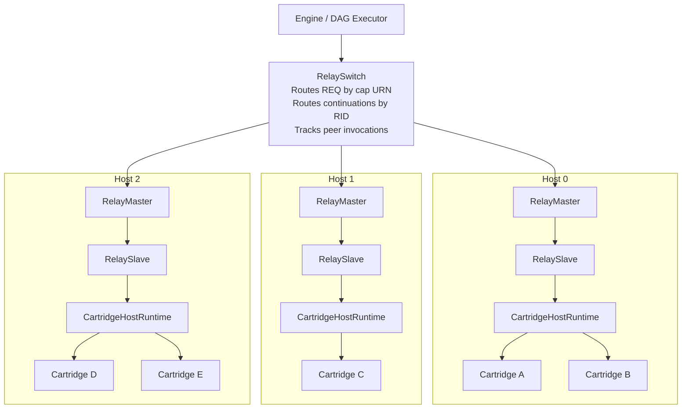
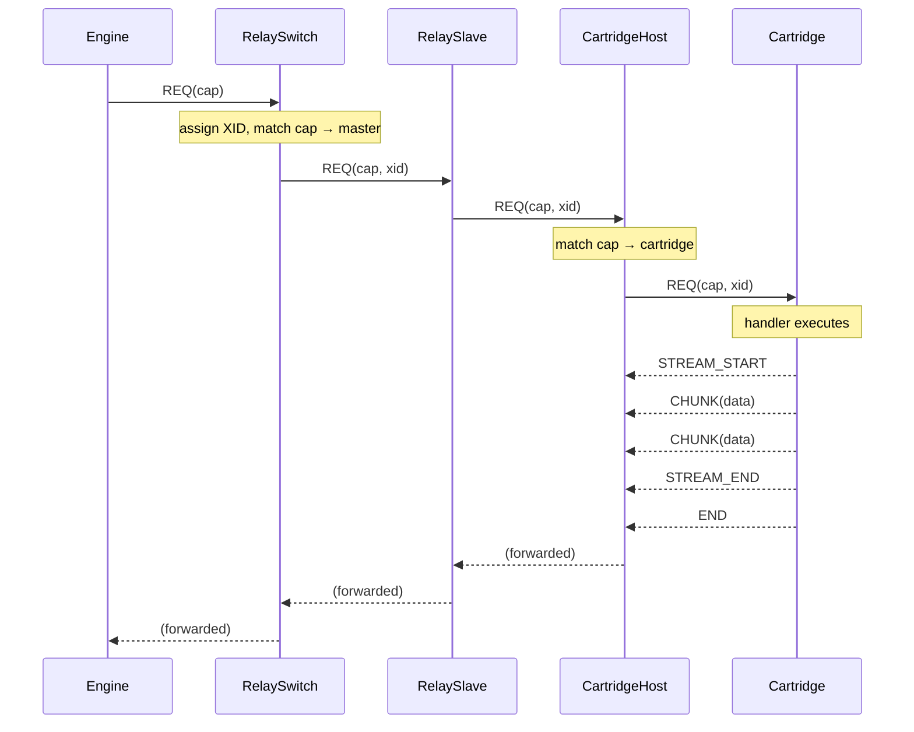
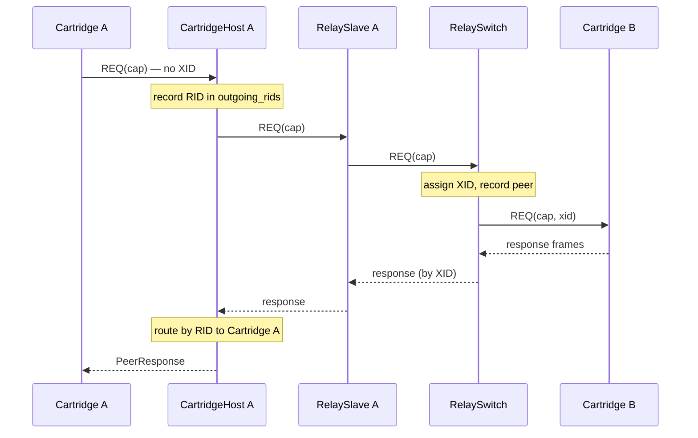
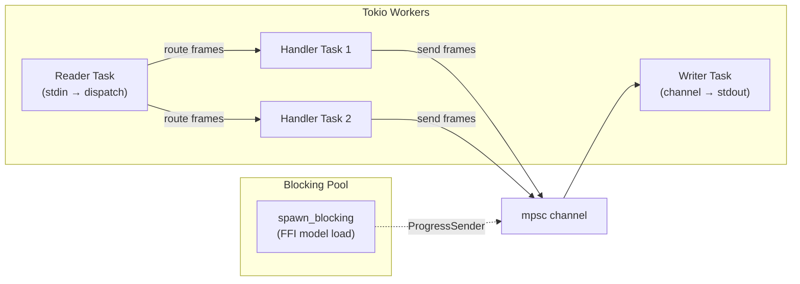

# capdag Architecture

How the components connect, what role each plays, and how frames flow through the system.

## System Topology

capdag arranges components in three layers. The engine sits at the top and issues capability invocation requests. Cartridges sit at the bottom and execute those requests. Between them, a relay network routes frames to the right destination.

Each CartridgeHostRuntime manages one or more cartridge processes. RelayMaster/RelaySlave pairs connect each host to the central RelaySwitch over Unix sockets. The switch aggregates all capabilities from all hosts and routes requests to the correct one.

Connection types:
- Switch ↔ Master: Unix socket
- Master ↔ Slave: Unix socket (same pair)
- Host ↔ Cartridge: stdin/stdout pipes

Source: `capdag/src/bifaci/relay_switch.rs`, `relay.rs`, `host_runtime.rs`, `cartridge_runtime.rs`.

## Component Roles

### RelaySwitch

The RelaySwitch is a routing multiplexer that sits between the engine and the relay masters. When the engine (or the orchestrator's DAG executor) needs to invoke a capability, the switch decides which master to send the request to.

Routing works in two stages:

1. **REQ frames**: The switch matches the request's cap URN against each master's capability set using `is_dispatchable` (see [../07-DISPATCH.md](../07-DISPATCH.md)). When multiple masters can handle a cap, the switch picks the most specific match using the ranking function (see [../08-RANKING.md](../08-RANKING.md)). The switch assigns a routing ID (XID) to the request and records the mapping so that response frames can find their way back.

2. **Continuation frames** (STREAM_START, CHUNK, STREAM_END, END, ERR, LOG): Routed by the (XID, RID) pair recorded when the REQ was sent. No cap matching happens — the routing table already knows the destination.

The switch uses interior mutability (`RwLock`, `AtomicU64`, `Mutex`) so that multiple DAG executions can route frames concurrently without holding exclusive locks.

Source: `capdag/src/bifaci/relay_switch.rs`.

### RelaySlave and RelayMaster

A RelaySlave/RelayMaster pair forms a transparent frame bridge over a Unix socket. The slave sits in the host process (e.g., an XPC service); the master sits in the engine process next to the RelaySwitch.

All regular frames pass through the relay unchanged in both directions. Two frame types are intercepted and never leak through:

- **RelayNotify** (slave → master): The slave sends this to advertise the capabilities of its cartridges. The master stores the manifest and limits. The switch reads these to build its routing table.
- **RelayState** (master → slave): The master sends this to provide host resources (model paths, GPU availability, etc.) to the slave. The slave stores the payload and makes it available to the CartridgeHostRuntime.

The relay also applies a `ReorderBuffer` at the slave side (socket → local direction) to ensure frames arrive in sequence order despite potential timing differences across masters.

Source: `capdag/src/bifaci/relay.rs`.

### CartridgeHostRuntime

The CartridgeHostRuntime manages multiple cartridge processes within a single host. It connects to the relay slave on one side and to cartridge processes on the other via stdin/stdout pipes.

Its responsibilities:

- **Handshake**: When a cartridge is first needed, the host spawns the process, performs the HELLO exchange to get the cartridge's manifest, and runs identity verification (see [12.3-HANDSHAKE.md](12.3-HANDSHAKE.md)).
- **Request routing**: Incoming REQ frames are routed to the cartridge that handles the requested cap URN. On-demand spawning means cartridges start only when their capabilities are first invoked.
- **Continuation routing**: STREAM_START, CHUNK, STREAM_END, END, and ERR frames are routed by the (XID, RID) pair to the cartridge that is handling the original request.
- **Peer call routing**: When a cartridge sends a REQ (a peer invocation), the host records the source cartridge, forwards the request to the relay with the appropriate XID, and routes the response back to the requesting cartridge.
- **Health monitoring**: Heartbeat probes are sent every 30 seconds. If a cartridge does not respond within 10 seconds, it is marked unhealthy. If a cartridge process dies, the host sends ERR frames for all pending requests and marks the cartridge as dead.

Source: `capdag/src/bifaci/host_runtime.rs`.

### CartridgeRuntime

The CartridgeRuntime is the cartridge-side counterpart. It reads frames from stdin, dispatches them to registered handlers by cap URN, and writes response frames to stdout.

Key behaviors:

- **Mode detection**: If the process is launched with command-line arguments, the runtime runs in CLI mode (parsing arguments from cap definitions). If launched with no arguments, it runs in cartridge CBOR mode (reading frames from stdin). This lets the same binary serve as both a CLI tool and a capdag cartridge.
- **Handler registration**: Handlers are registered by cap URN. Each handler receives an `InputStream` (or `InputPackage` for multi-argument caps), an `OutputStream` for writing response data, and a `PeerInvoker` for calling other cartridges.
- **Writer task**: A dedicated tokio task drains the output channel and writes frames to stdout. This separation means handler code can queue frames without blocking on I/O.
- **Multiplexed requests**: Multiple requests can be in flight concurrently. Each request gets its own task with its own input/output channels.

Source: `capdag/src/bifaci/cartridge_runtime.rs`.

### InProcessCartridgeHost

The InProcessCartridgeHost is an alternative to CartridgeHostRuntime that dispatches frames directly to `FrameHandler` trait objects in the same process, without spawning separate binaries. It connects to a RelaySlave in the same way and routes frames using the same protocol, but handler code runs as async tasks rather than external processes.

This is used for testing and for embedded scenarios where the overhead of process spawning is unnecessary.

Source: `capdag/src/bifaci/in_process_host.rs`.

## Frame Flow

### Request Lifecycle

A complete capability invocation follows this path:

The REQ carries the cap URN in key 10. The RelaySwitch assigns an XID (routing_id, key 11) and records the mapping `(XID, RID) → destination master`. All subsequent frames for this request carry the same (XID, RID) pair and follow the recorded route.

Response frames flow back through the same components in reverse. The relay and switch are transparent to the payload — they only inspect frame_type, id, and routing_id for routing decisions.

### Peer Invocation Flow

When Cartridge A needs to call a capability provided by Cartridge B:

Cartridge A sends a REQ without an XID — the cartridge doesn't know about routing IDs. The CartridgeHostRuntime records the request's RID in `outgoing_rids` and forwards it. The RelaySwitch assigns an XID, records the request as a peer invocation in `peer_requests`, and routes to Cartridge B's master. Response frames flow back through the same path, with the switch using the (XID, RID) mapping to route them to Cartridge A's master.

The CartridgeHostRuntime on Cartridge A's side routes the response to Cartridge A's `PeerResponse` channel by matching the RID from `outgoing_rids`.

### Identity Verification

After the HELLO handshake, the host runs identity verification to prove the entire protocol stack works before sending live traffic.

The host sends a REQ for `CAP_IDENTITY` with a deterministic nonce — CBOR-encoded `Text("bifaci")`, a 7-byte value. The request follows the standard streaming pattern: REQ → STREAM_START → CHUNK(nonce) → STREAM_END → END. The cartridge's identity handler echoes the nonce back through the same streaming pattern.

The host compares the echoed bytes to the original nonce. A mismatch means the protocol stack is broken — frame encoding, routing, or handler dispatch has a bug. This is a fatal error; the connection is abandoned.

Source: `capdag/src/bifaci/io.rs` (`verify_identity`, `identity_nonce`).

## Protocol Version

The current protocol version is 2, set in the `PROTOCOL_VERSION` constant (`capdag/src/bifaci/frame.rs:43`). Every frame carries this in key 0.

Version 2 replaced the old single-response model (the removed `Res` frame type, discriminant 2) with multiplexed streaming. A response now consists of one or more named streams (STREAM_START/CHUNK/STREAM_END) terminated by END. Version 2 also added chunk_index, chunk_count, and checksum fields for data integrity, and routing_id for relay-aware routing.

## Threading Model

### Rust (tokio)

The Rust CartridgeRuntime uses a tokio multi-threaded runtime. The main components:

- **Main thread**: Calls `tokio::runtime::Runtime::block_on()` to start the async event loop.
- **Reader task**: Reads frames from stdin and dispatches them to handler tasks by request ID.
- **Writer task**: A `tokio::spawn` task that receives frames from an `mpsc` channel and writes them to stdout. All handlers send frames through this channel rather than writing to stdout directly. This serializes output and prevents interleaving.
- **Handler tasks**: One `tokio::spawn` per active request. Each runs the registered handler's async code.
- **Blocking FFI**: Model loads and other blocking calls use `tokio::task::spawn_blocking` to run on a dedicated thread pool. This prevents blocking the tokio worker threads that the writer task and other async tasks need. See [13.4-PROGRESS-AND-LOGGING.md](13.4-PROGRESS-AND-LOGGING.md) for the keepalive mechanism that prevents activity timeouts during blocking work.

### Swift (structured concurrency)

The Swift CartridgeRuntime uses Apple's structured concurrency:

- **`run()`**: Blocks the calling thread using a `DispatchSemaphore`, while an internal `Task` runs the async event loop.
- **`Op.perform()`**: Each handler's `perform()` method runs inside a `Task` created by `dispatchOp()`. The `dispatchOp` wrapper signals the semaphore when the task completes.
- **Keepalive**: Background `Task` instances emit progress frames at 30-second intervals during blocking operations. Cancellation of the keepalive task happens when the blocking work completes.

The key constraint in Swift: `dispatchOp()` already wraps `Op.perform()` in a `Task` + `DispatchSemaphore.wait()`. Nesting another `Task` + semaphore inside `perform()` would deadlock the async executor because the outer semaphore is blocking a thread that the inner Task needs to run on.
