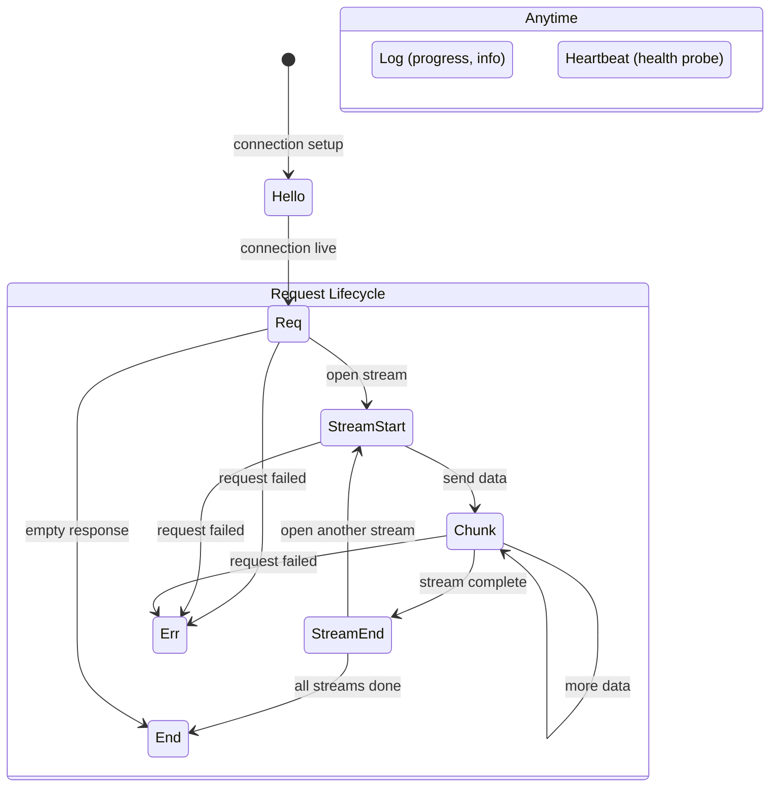

# Frame Protocol

The binary wire format: frame types, CBOR encoding, field semantics.

## Wire Format

Every capdag message is a length-prefixed CBOR frame:

```
┌──────────────────────────────────────────┐
│  4 bytes: u32 big-endian payload length  │
├──────────────────────────────────────────┤
│  N bytes: CBOR-encoded map (integer keys)│
└──────────────────────────────────────────┘
```

The 4-byte prefix gives the exact byte count of the CBOR payload that follows. The receiver reads exactly that many bytes, then decodes the CBOR map.

There are two size limits:

- **Negotiated max_frame** (default 3.5 MB / 3,670,016 bytes): Set during handshake. Frames larger than this are rejected by both reader and writer.
- **Hard limit** (16 MB / 16,777,216 bytes): An absolute ceiling to prevent memory exhaustion. Cannot be negotiated upward.

Payloads that exceed max_frame must be split into chunks (see [12.4-STREAMING.md](12.4-STREAMING.md)).

Source: `capdag/src/bifaci/io.rs` (`encode_frame`, `decode_frame`, `write_frame`, `read_frame`).

## Frame Structure

The CBOR payload is a map with integer keys. Every frame has three required keys (version, frame_type, id). All other keys are optional and their presence depends on the frame type.

### Key Reference Table

| Key | Name | Type | Description |
|-----|------|------|-------------|
| 0 | version | u8 | Protocol version. Always 2. |
| 1 | frame_type | u8 | Discriminant identifying the frame type (see below). |
| 2 | id | bytes[16] or uint | Request ID. UUID for requests, uint for control frames. |
| 3 | seq | u64 | Sequence number within a flow. Assigned by SeqAssigner at output. |
| 4 | content_type | text | MIME-like content type of the payload. |
| 5 | meta | map | String-keyed metadata map. Contents depend on frame type. |
| 6 | payload | bytes | Binary payload data. |
| 7 | len | u64 | Total byte count for a chunked transfer. Set on the first chunk only. |
| 8 | offset | u64 | Byte offset of this chunk within the stream. |
| 9 | eof | bool | True on the final chunk of a stream or on END frames. |
| 10 | cap | text | Cap URN for REQ frames. Identifies which capability to invoke. |
| 11 | stream_id | text | UUID identifying a stream within a request. |
| 12 | media_urn | text | Media URN identifying the data type of a stream. |
| 13 | routing_id | bytes[16] or uint | XID assigned by RelaySwitch for routing. |
| 14 | chunk_index | u64 | Zero-based index of this chunk within its stream. |
| 15 | chunk_count | u64 | Total number of chunks in a stream. Set on STREAM_END. |
| 16 | checksum | u64 | FNV-1a 64-bit hash of the chunk payload. |

Source: `capdag/src/bifaci/frame.rs` (keys module, line 910; Frame struct, line 184).

## Frame Types

The following diagram shows how frame types relate within a request lifecycle:



### Hello (0)

Sent once by each side during connection setup. The host sends Hello first (no manifest); the cartridge responds with Hello including a JSON-encoded manifest in `meta["manifest"]`.

The meta map also carries limit proposals: `max_frame`, `max_chunk`, and `max_reorder_buffer`. Both sides negotiate limits by taking the minimum of the two proposals. See [12.3-HANDSHAKE.md](12.3-HANDSHAKE.md) for the full handshake sequence.

Hello uses `id = Uint(0)` — it is not associated with any request.

Source: `frame.rs` (`Frame::hello`, `Frame::hello_with_manifest`).

### Req (1)

Initiates a capability invocation. The `cap` field (key 10) carries the cap URN to invoke. The request may include a payload and content_type for inline data, though most arguments arrive as separate streams (STREAM_START/CHUNK/STREAM_END).

The `routing_id` (key 13) is assigned by the RelaySwitch at routing boundaries. Cartridges sending peer invocations do not set routing_id — it is added by the infrastructure.

The cap URN is validated at construction time — `Frame::req()` panics if the URN is malformed. This is intentional: invalid URNs are bugs, not runtime errors.

Source: `frame.rs` (`Frame::req`).

### Chunk (3)

Carries a piece of streaming data within a named stream. Required fields:

- `stream_id` (key 11): Which stream this chunk belongs to.
- `chunk_index` (key 14): Zero-based position of this chunk within the stream. Monotonically increasing.
- `checksum` (key 16): FNV-1a 64-bit hash of the payload bytes. Mandatory for corruption detection.

Optional fields set by the chunking layer:

- `offset` (key 8): Byte offset of this chunk's data within the total stream.
- `len` (key 7): Total byte count. Set on the first chunk only (chunk_index = 0).
- `eof` (key 9): True on the last chunk.
- `content_type` (key 4): Set on the first chunk only.

Source: `frame.rs` (`Frame::chunk`, `Frame::chunk_with_offset`).

### End (4)

Terminal frame that signals all streams for a request are complete. No STREAM_START, CHUNK, or other data frames may follow an END for the same request ID. May carry an optional final payload.

The `eof` field is set to true.

Source: `frame.rs` (`Frame::end`).

### Log (5)

Carries log messages and progress updates. The `meta` map (key 5) contains:

- `level` (text): One of `"info"`, `"warn"`, `"error"`, `"progress"`, or a custom string.
- `message` (text): Human-readable message.
- `progress` (float, optional): A value between 0.0 and 1.0. Present only when `level` is `"progress"`.

Progress frames are LOG frames with `level = "progress"`. They are not a separate frame type — the same frame structure carries both log messages and progress updates.

LOG frames can appear at any point during a request, interleaved with CHUNK frames. They do not affect the data stream.

Source: `frame.rs` (`Frame::log`, `Frame::progress`, `log_level`, `log_message`, `log_progress`).

### Err (6)

Terminal frame that signals failure. Like END, no further frames may follow for this request. The `meta` map carries:

- `code` (text): Machine-readable error code.
- `message` (text): Human-readable error description.

ERR and END are mutually exclusive terminals. A request ends with exactly one of them.

Source: `frame.rs` (`Frame::err`, `error_code`, `error_message`).

### Heartbeat (7)

Health monitoring frame. Either side can send a Heartbeat; the receiver must respond with a Heartbeat carrying the same `id`. The CartridgeHostRuntime sends heartbeats every 30 seconds and expects a response within 10 seconds. A cartridge that fails to respond is marked unhealthy.

Heartbeat frames bypass sequence numbering — they are not flow frames and do not participate in ordering.

Source: `frame.rs` (`Frame::heartbeat`); see also `host_runtime.rs` (`HEARTBEAT_INTERVAL`, `HEARTBEAT_TIMEOUT`).

### StreamStart (8)

Announces a new named stream within a request. Carries:

- `stream_id` (key 11): A UUID uniquely identifying this stream within the request.
- `media_urn` (key 12): The media URN (see [./11-MEDIA-URNS.md](./11-MEDIA-URNS.md)) that identifies the data type of the stream.

Multiple STREAM_START frames per request enable multi-argument invocations — each argument is a separate stream with its own media URN.

Source: `frame.rs` (`Frame::stream_start`).

### StreamEnd (9)

Marks the end of a specific stream. After this frame, any CHUNK for the same stream_id is a protocol error. Carries:

- `stream_id` (key 11): The stream being ended.
- `chunk_count` (key 15): The total number of CHUNK frames sent in this stream, by the sender's count. The receiver can verify it received all chunks.

Source: `frame.rs` (`Frame::stream_end`).

### RelayNotify (10)

Sent by a RelaySlave to its paired RelayMaster to advertise the capabilities available on that host. The `meta` map carries:

- `manifest` (bytes): JSON-encoded aggregate manifest of all cartridges on the host.
- `max_frame`, `max_chunk`, `max_reorder_buffer`: Protocol limits for this relay connection.

RelayNotify frames are intercepted by the relay — they never pass through to the other side. The master stores the manifest and limits and makes them available to the RelaySwitch for routing decisions.

Source: `frame.rs` (`Frame::relay_notify`); see also [14.3-RELAY-TOPOLOGY.md](14.3-RELAY-TOPOLOGY.md).

### RelayState (11)

Sent by a RelayMaster to its paired RelaySlave to provide host resource information. The `payload` (key 6) carries an opaque blob (CBOR or JSON encoded by the engine) containing resource state such as model paths, GPU availability, or capability demands.

Like RelayNotify, RelayState frames are intercepted by the relay and never pass through.

Source: `frame.rs` (`Frame::relay_state`).

## MessageId

Frame IDs come in two variants:

- **Uuid**: 16 random bytes (v4 UUID). Used for request IDs and stream IDs — anything that needs to be globally unique.
- **Uint**: A 64-bit integer. Used for control frames (Hello uses `id = 0`, Heartbeat can use any integer).

UUIDs are encoded as CBOR byte strings (major type 2, 16 bytes). Integers are encoded as CBOR unsigned integers (major type 0).

Source: `frame.rs` (`MessageId` enum).

## Flow Frames vs Control Frames

Frames are classified as **flow** or **non-flow**. The distinction matters for sequence numbering and reordering:

- **Flow frames**: Req, Chunk, End, Log, Err, StreamStart, StreamEnd. These participate in sequencing — the `SeqAssigner` assigns monotonically increasing `seq` values per flow, and the `ReorderBuffer` at relay boundaries reorders them if they arrive out of sequence.
- **Non-flow frames**: Hello, Heartbeat, RelayNotify, RelayState. These bypass sequence assignment entirely (their `seq` stays at 0) and are not buffered by the reorder buffer.

The `is_flow_frame()` method on `Frame` returns this classification.

Source: `frame.rs` (`is_flow_frame`, line 737).

## Checksum

Every CHUNK frame carries a checksum in key 16: an FNV-1a 64-bit hash of the payload bytes. The sender computes it via `Frame::compute_checksum()`:

```rust
const FNV_OFFSET_BASIS: u64 = 0xcbf29ce484222325;
const FNV_PRIME: u64 = 0x100000001b3;

let mut hash = FNV_OFFSET_BASIS;
for &byte in data {
    hash ^= u64::from(byte);
    hash = hash.wrapping_mul(FNV_PRIME);
}
```

The receiver verifies the checksum after decoding. A mismatch is a protocol error — the frame is rejected.

FNV-1a was chosen for speed and simplicity, not cryptographic strength. It detects accidental corruption (bit flips, truncation) but is not designed to resist intentional tampering.

Source: `frame.rs` (`compute_checksum`, line 722).
