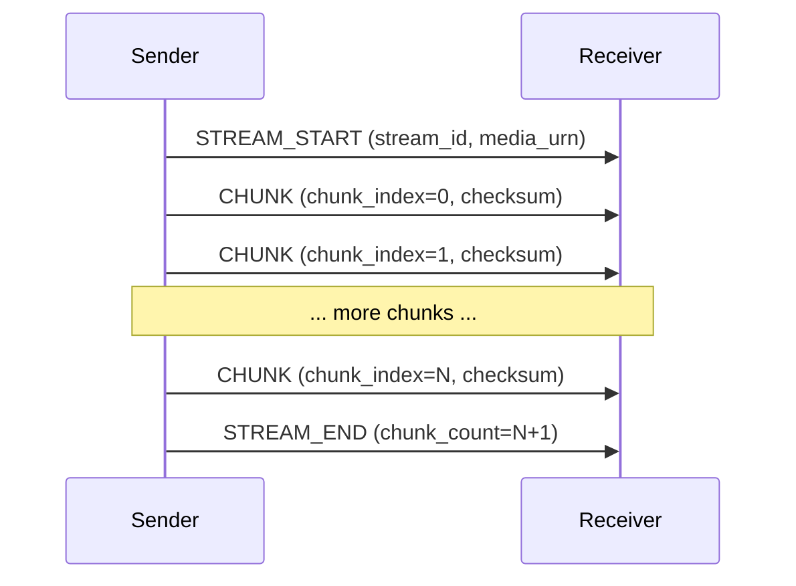
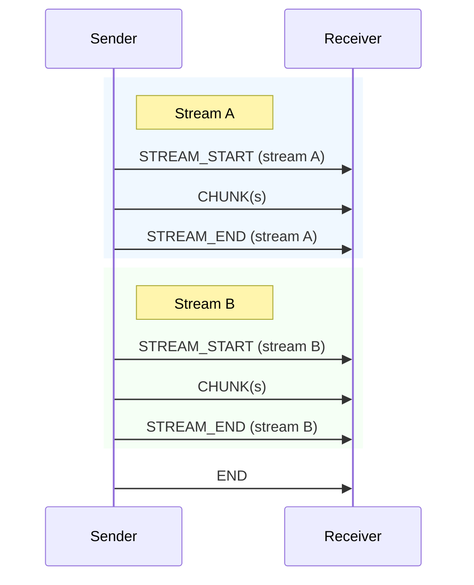
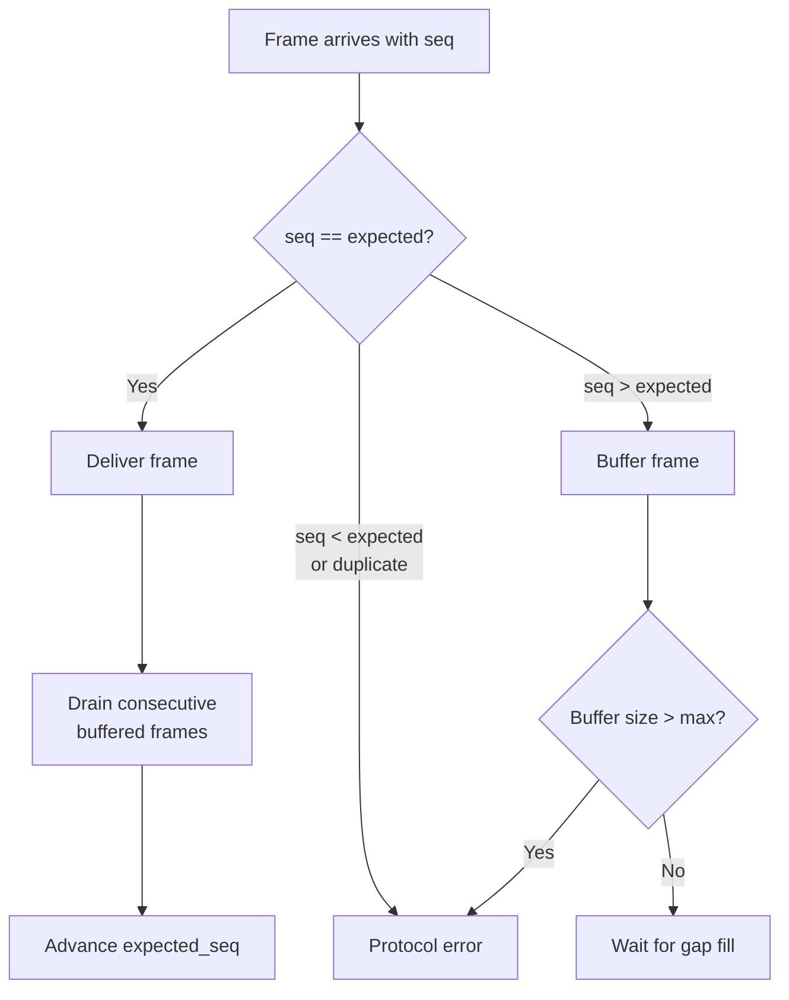

# Streaming

Multiplexed streams, chunking, sequence numbering, and reordering.

## Multiplexed Streams

A single request (identified by its request ID in key 2) can carry multiple named streams. Each stream has a unique `stream_id` (key 11) and a `media_urn` (key 12) that identifies the data type flowing through it.

This enables multi-argument capability invocations. For example, a cap that accepts both a PDF document and a prompt string receives them as two separate streams within the same request — one with `media_urn = "media:pdf"` and one with `media_urn = "media:text;encoding=utf8"`. On the response side, a handler can emit multiple output streams too.

Source: `capdag/src/bifaci/frame.rs` (StreamStart, StreamEnd); `plugin_runtime.rs` (InputStream, OutputStream).

### Stream Lifecycle

A stream follows this sequence:



- **STREAM_START** announces the stream. The `media_urn` tells the receiver what kind of data to expect.
- **CHUNK** frames carry payload data. Each has a `chunk_index` starting at 0 and a `checksum` for integrity.
- **STREAM_END** marks the stream as complete. Its `chunk_count` field holds the total number of CHUNKs sent, allowing the receiver to verify it received them all.

After STREAM_END, any CHUNK for the same `stream_id` is a protocol error.

### Request Completion

After all streams within a request have ended (each with its own STREAM_END), the sender sends **END** to signal that no more streams will be opened and the request is complete:



No STREAM_START, CHUNK, or STREAM_END may follow an END for the same request ID.

**ERR** is an alternative terminal frame. It signals that the request failed. Like END, no data frames may follow it. ERR and END are mutually exclusive — a request ends with exactly one.

LOG frames (progress updates, log messages) can appear anywhere in the sequence, interleaved with CHUNK and between streams. They do not affect the data flow.

## Chunking

### Automatic Chunking

When the payload to send exceeds `max_chunk` (negotiated during handshake, default 256 KB), the writer splits it automatically. The `FrameWriter::write_chunked()` method handles this:

1. The first chunk (chunk_index = 0) carries `content_type`, `len` (total byte count), and `offset = 0`.
2. Subsequent chunks carry `offset` (the byte position within the total payload).
3. The final chunk has `eof = true`.

An empty payload is sent as a single chunk with `eof = true` and `len = 0`.

From the handler's perspective, this is transparent. The `OutputStream::write()` method calls `write_chunked` internally when the data exceeds the chunk size limit. The receiver's `InputStream` reassembles chunks in order.

Source: `capdag/src/bifaci/io.rs` (`FrameWriter::write_chunked`); `plugin_runtime.rs` (`OutputStream::write`).

### Chunk Fields

Every CHUNK frame carries:

| Field | Key | Required | Description |
|-------|-----|----------|-------------|
| stream_id | 11 | yes | Which stream this chunk belongs to. |
| chunk_index | 14 | yes | Zero-based position within the stream. |
| checksum | 16 | yes | FNV-1a 64-bit hash of the payload bytes. |
| payload | 6 | yes | The chunk data. |
| offset | 8 | typical | Byte offset of this chunk's data within the total stream. |
| len | 7 | first only | Total byte count of the entire payload. Set on chunk_index = 0. |
| content_type | 4 | first only | MIME-like type. Set on chunk_index = 0. |
| eof | 9 | last only | True on the final chunk. |

The `chunk_index` and `checksum` fields are validated at decode time — a CHUNK frame missing either is rejected with a protocol error.

## Sequence Numbering

Frames within a request need to arrive in order for the protocol to work correctly. At relay boundaries, frames from different masters may interleave or arrive out of order. Sequence numbers enable detection and correction of this.

### FlowKey

A flow is identified by the pair `(request_id, optional routing_id)` — called a `FlowKey`. Each unique FlowKey gets its own independent sequence counter.

```rust
pub struct FlowKey {
    pub rid: MessageId,       // request ID (key 2)
    pub xid: Option<MessageId>, // routing ID (key 13), if present
}
```

The presence or absence of an XID matters. `(RID=A, XID=None)` and `(RID=A, XID=Some(5))` are two separate flows with independent counters. This distinction exists because the same request may be seen with and without an XID at different points in the relay chain — before and after the RelaySwitch assigns one.

Source: `frame.rs` (`FlowKey`).

### SeqAssigner

The `SeqAssigner` assigns monotonically increasing sequence numbers per FlowKey. It sits at the output stage — in the writer task, not at frame creation time. This ensures that the seq values reflect the actual order frames are written to the wire.

```rust
pub struct SeqAssigner {
    counters: HashMap<FlowKey, u64>,
}
```

For each flow, the counter starts at 0 and increments by 1 with each frame. There are no gaps. Non-flow frames (Hello, Heartbeat, RelayNotify, RelayState) are skipped — the assigner leaves their seq at 0.

After a terminal frame (END or ERR) is assigned, the flow's counter should be cleaned up via `remove()`.

Source: `frame.rs` (`SeqAssigner`).

## Reorder Buffer

The `ReorderBuffer` sits at relay boundaries (specifically in the RelaySlave, on the socket → local path) and ensures frames are delivered in sequence order.

```rust
pub struct ReorderBuffer {
    flows: HashMap<FlowKey, FlowState>,
    max_buffer_per_flow: usize,
}

struct FlowState {
    expected_seq: u64,
    buffer: BTreeMap<u64, Frame>,
}
```

When a frame arrives:



1. **In order** (seq == expected_seq): Delivered immediately, along with any consecutive frames already buffered. The expected_seq advances past all delivered frames.
2. **Out of order** (seq > expected_seq): Buffered. The frame waits until the gap is filled.
3. **Stale or duplicate** (seq < expected_seq, or seq already buffered): Protocol error. The frame is rejected.

If the buffer holds more than `max_buffer_per_flow` frames (default 64) for a single flow, that is also a protocol error — it means the gap is too large and something has gone wrong.

Non-flow frames bypass the reorder buffer entirely and are returned immediately.

After a terminal frame (END or ERR) is delivered, `cleanup_flow()` removes the flow's state from the buffer.

Source: `frame.rs` (`ReorderBuffer`).
