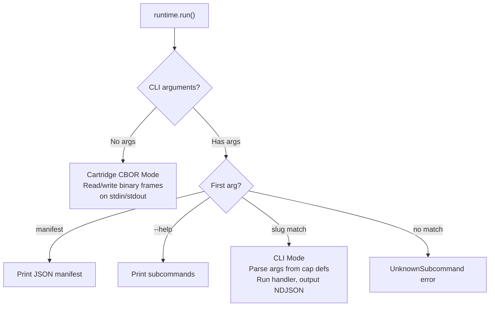
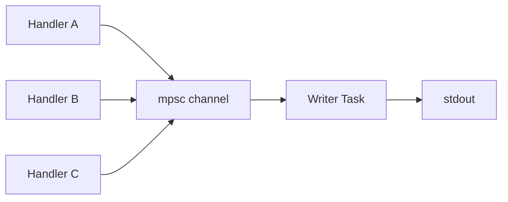
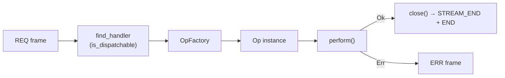

# Cartridge Runtime

The cartridge-side entry point: handler registration, mode detection, and the main frame processing loop.

## CartridgeRuntime

`CartridgeRuntime` is the only supported way for a cartridge to communicate with the host. A cartridge creates a runtime with its manifest, registers handlers for each capability it provides, and calls `run()`. The runtime handles everything else — handshake, frame parsing, request routing, response framing, heartbeat replies.

```rust
let manifest = build_manifest();
let mut runtime = CartridgeRuntime::with_manifest(manifest);

runtime.register_op("cap:in=...;out=...;generate", || {
    Box::new(MyGenerateOp::default())
});

runtime.run().unwrap();
```

The struct itself is small:

```rust
pub struct CartridgeRuntime {
    handlers: HashMap<String, OpFactory>,   // cap URN → handler factory
    manifest_data: Vec<u8>,                 // JSON-encoded manifest (sent in HELLO)
    manifest: Option<CapManifest>,          // parsed manifest (for CLI mode)
    limits: Limits,                         // negotiated protocol limits
}
```

Source: `capdag/src/bifaci/cartridge_runtime.rs:1829`.

## Manifest Construction

The manifest tells the host what capabilities this cartridge provides. It is built with `CapManifest`:

```rust
let manifest = CapManifest::new(
    "mycartridge".to_string(),
    "1.0.0".to_string(),
    "Description of what this cartridge does".to_string(),
    vec![CapGroup::default_group(vec![identity_cap(), my_cap_1, my_cap_2])],
);
```

Each `Cap` in the list has:

- A **cap URN** built via `CapUrn::from_string()` or a builder — defines what inputs the cap accepts, what outputs it produces, and what operation tags it carries.
- A **title** and **slug** for display and CLI subcommand naming.
- **Arguments** (`CapArg`): each with a media URN, required flag, and one or more sources (`ArgSource::Stdin`, `ArgSource::FilePath`, `ArgSource::Slot`).

The manifest must always include `identity_cap()` — the identity capability required for handshake verification (see [12.3-HANDSHAKE.md](12.3-HANDSHAKE.md)). `CartridgeRuntime::new()` panics if CAP_IDENTITY is missing.

Source: `capdag/src/bifaci/manifest.rs` (`CapManifest`); `capdag/src/cap/definition.rs` (`Cap`, `CapArg`, `ArgSource`).

## Handler Registration

Two methods register handlers:

### register_op(cap_urn, factory)

Registers a factory closure that creates a fresh `Op<()>` instance per request:

```rust
runtime.register_op("cap:in=...;out=...;describe", || {
    Box::new(DescribeOp::new(some_config))
});
```

The factory is called once per incoming REQ. This lets handlers hold per-request state.

### register_op_type::\<T\>(cap_urn)

Registers a type that implements `Op<()> + Default`. Instances are created via `T::default()`:

```rust
runtime.register_op_type::<ExtractMetadataOp>("cap:in=...;out=...;extract;target=metadata");
```

### Handler Lookup

When a REQ arrives, the runtime finds the handler by matching the request's cap URN against registered cap URNs using `is_dispatchable(provider, request)` (see [../07-DISPATCH.md](../07-DISPATCH.md)). When multiple handlers match, the runtime ranks by specificity — preferring exact matches, then refinements (more specific than requested), then fallbacks (more generic).

The cap URN string used in `register_op` must be parseable by `CapUrn::from_string()`. It does not need to be character-for-character identical to the manifest entry, but it must dispatch equivalently.

Source: `cartridge_runtime.rs` (`register_op`, `register_op_type`, `find_handler`).

## Mode Detection



`run()` checks the process's command-line arguments:

- **No arguments**: Cartridge CBOR mode. The runtime reads binary frames from stdin and writes to stdout. This is how the host invokes cartridges.
- **Any arguments**: CLI mode. The runtime parses arguments from cap definitions and runs the matching handler directly. Output goes to stdout as NDJSON.

This dual-mode design means a single binary serves as both a capdag cartridge (when launched by the host with no args) and a standalone CLI tool (when run directly by a user).

CLI mode supports:
- `manifest` subcommand: prints the JSON manifest.
- `<slug>` subcommand: finds the cap whose slug matches, parses arguments from the cap's `CapArg` definitions, and invokes the handler.
- `--help`: lists available subcommands.

Source: `cartridge_runtime.rs` (`run`, line 2010).

## Cartridge Mode Main Loop

When running in cartridge CBOR mode, `run()` executes these steps:

1. **Handshake**: Call `handshake_accept()` to exchange HELLO frames and negotiate limits. The host initiates; the cartridge responds with its manifest.

2. **Spawn writer task**: A `tokio::spawn` task receives frames from an unbounded `mpsc` channel and writes them to stdout. This task is the only thing that touches stdout — all handlers send frames through the channel.

3. **Read loop**: Read frames from stdin in a loop.
   - **REQ**: Look up a handler by `cap_urn`. Spawn a new handler task (`tokio::spawn`) with its own `InputPackage` and `OutputStream`. Record the request ID so continuation frames can be routed to this task.
   - **Heartbeat**: Respond immediately with a Heartbeat carrying the same ID. This is handled inline — no task spawned.
   - **STREAM_START / CHUNK / STREAM_END / END**: Route to the handler task that owns the request ID. These frames feed the handler's `InputPackage`.
   - **LOG / ERR (from peer responses)**: Route to the handler task's peer response channel.
   - **stdin EOF**: Break the loop and shut down.

4. **Shutdown**: Wait for all handler tasks to complete, then drop the writer task.

Source: `cartridge_runtime.rs` (run method).

### Writer Task

The writer task is a `tokio::spawn` that loops on an `mpsc::UnboundedReceiver<Frame>`:



All handlers and the runtime itself send frames through this channel. The writer serializes each frame to CBOR, prepends the 4-byte length, and writes to stdout.

This architecture is why `spawn_blocking` matters: if a handler blocks a tokio worker thread (e.g., during a synchronous FFI model load), the writer task cannot run because it also needs a tokio worker. Frames queue in the channel but never reach stdout. The engine sees no frames and triggers its 120-second activity timeout.

`run_with_keepalive()` solves this by moving blocking work to `tokio::task::spawn_blocking` (a separate thread pool), freeing the tokio workers so the writer task can flush keepalive frames. See [13.4-PROGRESS-AND-LOGGING.md](13.4-PROGRESS-AND-LOGGING.md).

## Op Trait

Handlers implement the `Op<()>` trait from the `ops` crate:

```rust
#[async_trait]
pub trait Op<T>: Send + Sync {
    async fn perform(&self, dry: &mut DryContext, wet: &mut WetContext) -> OpResult<T>;
    fn metadata(&self) -> OpMetadata;
}
```

- `perform()` runs the handler logic. It receives a `DryContext` (control flags, dry-run state) and a `WetContext` (a typed key-value store). The `WetContext` holds an `Arc<Request>` under the key `"request"`.
- `metadata()` returns descriptive information about the operation.



The runtime calls `dispatch_op()`, which:
1. Creates a `Request` from the input, output, and peer invoker.
2. Inserts the `Request` into a fresh `WetContext`.
3. Calls `op.perform()`.
4. On success, closes the output stream (sends STREAM_END if the stream was started).
5. On error, the runtime sends an ERR frame for the request.

Source: `cartridge_runtime.rs` (`dispatch_op`, line 1846); `ops` crate.

## Request Object

The `Request` struct bundles the three things a handler needs:

```rust
pub struct Request {
    input: Mutex<Option<InputPackage>>,
    output: Arc<OutputStream>,
    peer: Arc<dyn PeerInvoker>,
}
```

- **`take_input()`** → `InputPackage`: The bundle of all input argument streams. Can only be called once — second call returns an error. This prevents double-consumption bugs.
- **`output()`** → `&OutputStream`: For emitting response data, progress, and log messages.
- **`peer()`** → `&dyn PeerInvoker`: For calling other cartridges' capabilities. See [13.3-PEER-INVOCATION.md](13.3-PEER-INVOCATION.md).

Handlers retrieve the `Request` from `WetContext`:

```rust
let req = wet.get_arc::<Request>(WET_KEY_REQUEST).unwrap();
let input = req.take_input()?;
let streams = input.collect_streams().await?;
let data = require_stream(&streams, "media:pdf")?;
req.output().write(result_bytes)?;
```

Source: `cartridge_runtime.rs` (`Request`, line 972).

## Swift Equivalent

The Swift `CartridgeRuntime` in `capdag-objc/Sources/Bifaci/CartridgeRuntime.swift` follows the same design:

- Construction: `CartridgeRuntime(manifest: manifestData)`.
- Registration: closures or `Op` types registered by cap URN string.
- `run()` blocks via `DispatchSemaphore` while an internal async event loop handles frames.
- Error types mirror the Rust variants (`CartridgeRuntimeError` with cases for handshake, noHandler, ioError, etc.).

Key differences from Rust:

- **Concurrency model**: Swift uses structured concurrency (`async/await` with `Task`) instead of tokio. Handler dispatch uses `Task` + `DispatchSemaphore.wait()` rather than `tokio::spawn`.
- **I/O**: Synchronous `FileHandle` reads on stdin instead of async I/O. The semaphore-based blocking model means the event loop runs on a single thread.
- **Deadlock risk**: Because `dispatchOp()` wraps `Op.perform()` in `Task` + `DispatchSemaphore.wait()`, nesting another `Task` + semaphore inside `perform()` deadlocks the async executor. This constraint does not exist in Rust's tokio model.

Source: `capdag-objc/Sources/Bifaci/CartridgeRuntime.swift`.
