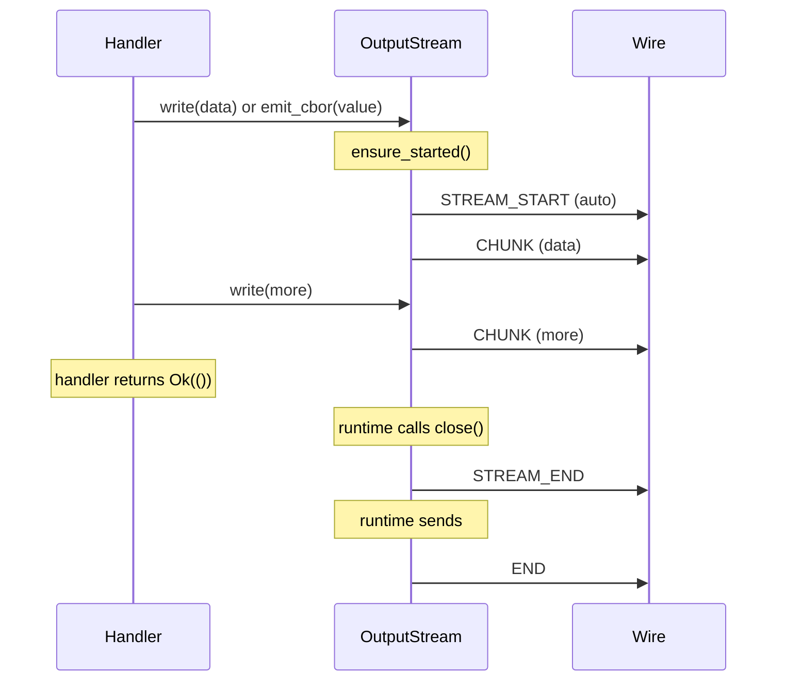

# Input and Output

How handlers receive input data and emit output data via typed streams.

## InputStream

An `InputStream` represents a single named input stream arriving from the host. Each stream carries a `media_urn` identifying the data type (e.g., `"media:pdf"`, `"media:text;encoding=utf8"`) and yields decoded CBOR values extracted from CHUNK frames.

Handlers never see raw frames, sequence numbers, checksums, or stream IDs. The runtime's demux layer decodes CHUNK payloads, verifies checksums, and delivers clean CBOR values through the stream.

```rust
pub struct InputStream {
    media_urn: String,
    rx: mpsc::UnboundedReceiver<Result<ciborium::Value, StreamError>>,
}
```

Source: `capdag/src/bifaci/cartridge_runtime.rs:146`.

### Receiving Data

Three consumption patterns:

**Streaming** — process values one at a time:

```rust
let mut stream = /* from InputPackage */;
while let Some(item) = stream.recv().await {
    let value = item?;
    // process each CBOR value
}
```

**Accumulate bytes** — collect everything into a byte buffer:

```rust
let bytes: Vec<u8> = stream.collect_bytes().await?;
```

`collect_bytes()` extracts the inner bytes from each `Value::Bytes` or `Value::Text` chunk and concatenates them. Non-byte CBOR types are CBOR-encoded before appending. Only use this when you know the stream is finite — infinite streams block forever.

**Single value** — expect exactly one chunk:

```rust
let value: ciborium::Value = stream.collect_value().await?;
```

Returns the first value and ignores the rest. Returns `StreamError::Closed` if the stream is empty.

## InputPackage

An `InputPackage` bundles all input streams for a single request. Handlers get it by calling `req.take_input()` (which can only be called once — second call returns an error to prevent double-consumption).

```rust
pub struct InputPackage {
    rx: mpsc::UnboundedReceiver<Result<InputStream, StreamError>>,
    _demux_handle: Option<JoinHandle<()>>,
}
```

The package yields `InputStream` objects as STREAM_START frames arrive from the wire. It returns `None` after the END frame, signaling all arguments have been delivered.

Three ways to consume an `InputPackage`:

**Collect each stream separately** (most common):

```rust
let input = req.take_input()?;
let streams: Vec<(String, Vec<u8>)> = input.collect_streams().await?;
// streams = [("media:pdf", <bytes>), ("media:text;encoding=utf8", <bytes>)]
```

Each stream's bytes are accumulated independently. Use the stream lookup helpers (below) to find specific arguments by media URN.

**Concatenate all streams**:

```rust
let all_bytes: Vec<u8> = input.collect_all_bytes().await?;
```

Useful when a cap has only one input stream and you just want the bytes.

**Iterate streams one at a time**:

```rust
while let Some(stream_result) = input.recv().await {
    let stream = stream_result?;
    println!("Got stream: {}", stream.media_urn());
    let bytes = stream.collect_bytes().await?;
}
```

Source: `cartridge_runtime.rs:266`.

## Stream Lookup Helpers

After collecting streams with `collect_streams()`, use these free functions to find specific arguments:

| Function | Returns | On miss |
|----------|---------|---------|
| `find_stream(streams, media_urn)` | `Option<&[u8]>` | `None` |
| `find_stream_str(streams, media_urn)` | `Option<String>` | `None` |
| `require_stream(streams, media_urn)` | `Result<&[u8]>` | `StreamError` |
| `require_stream_str(streams, media_urn)` | `Result<String>` | `StreamError` |

Matching uses `MediaUrn::is_equivalent()` — both URNs must have the exact same tag set (order-independent). This is an exact match, not subsumption or pattern matching. Both sides know the argument media URNs from the cap definition, so equivalence is the right test.

```rust
let streams = input.collect_streams().await?;
let pdf_data = require_stream(&streams, "media:pdf")?;
let prompt = find_stream_str(&streams, "media:text;encoding=utf8");
```

The `media_urn` parameter must be the full media URN from the cap's argument definition.

Source: `cartridge_runtime.rs` (`find_stream`, `require_stream`, line 316).

## OutputStream

`OutputStream` is the handler's interface for emitting response data, progress, and log messages. It manages STREAM_START/CHUNK/STREAM_END framing automatically — handlers write data, the stream handles the rest.

```rust
pub struct OutputStream {
    sender: Arc<dyn FrameSender>,
    stream_id: String,
    media_urn: String,
    request_id: MessageId,
    routing_id: Option<MessageId>,
    max_chunk: usize,
    stream_started: AtomicBool,
    chunk_index: Mutex<u64>,
    chunk_count: Mutex<u64>,
    closed: AtomicBool,
}
```

Source: `cartridge_runtime.rs:381`.

### Emitting Data

**Raw bytes** — auto-chunked at `max_chunk` boundaries:

```rust
req.output().write(b"result data here")?;
```

Splits the data into chunks of at most `max_chunk` bytes (default 256 KB). Each chunk is wrapped as `Value::Bytes` and sent as a CHUNK frame with checksum.

**Single CBOR value**:

```rust
req.output().emit_cbor(&ciborium::Value::Text("hello".to_string()))?;
```

Handles type-specific chunking: `Bytes` and `Text` are split at `max_chunk` boundaries (respecting UTF-8 character boundaries for text). `Array` elements are sent one per chunk. `Map` entries are sent as `[key, value]` pairs. Scalar types are sent as a single chunk.

**List item** (for streaming list output):

```rust
for item in items {
    req.output().emit_list_item(&item)?;
}
```

Each call CBOR-encodes the value and sends the raw bytes as chunk payloads. The receiver concatenates chunk payloads to produce an RFC 8742 CBOR sequence — one self-delimiting CBOR value per `emit_list_item` call. This differs from `emit_cbor`, which re-wraps each piece as a separate CBOR value.

**Progress and logging**:

```rust
req.output().progress(0.5, "Processing page 3 of 6");
req.output().log("info", "Found 12 images");
```

These emit LOG frames that travel alongside data frames. See [13.4-PROGRESS-AND-LOGGING.md](13.4-PROGRESS-AND-LOGGING.md).

**Close**:

```rust
req.output().close()?;
```

Sends STREAM_END with the total chunk count. Idempotent — calling it twice is safe.

### Implicit Stream Management



Handlers do not need to send STREAM_START, STREAM_END, or END frames manually:

- **STREAM_START**: Sent automatically before the first chunk. The first call to `write()`, `emit_cbor()`, or `emit_list_item()` triggers it via `ensure_started()`.
- **STREAM_END**: Sent by `close()`.
- **END**: Sent by the runtime after the handler returns.
- **On success**: The runtime calls `close()` after `perform()` returns `Ok(())`, which sends STREAM_END. Then it sends END.
- **On error**: The runtime sends an ERR frame instead of END.

If a handler writes nothing and returns success, the runtime still sends STREAM_START → STREAM_END → END (an empty stream is valid).

## CBOR Encoding Conventions

Arguments and results flow as CBOR values in CHUNK payloads. The encoding conventions:

- **Text arguments** (prompts, file paths, configuration strings): sent as `Value::Bytes` containing UTF-8 encoded text — not JSON-quoted. A prompt string `"hello world"` becomes the raw bytes `hello world`, not `"hello world"`.
- **Binary data** (images, PDFs, model weights): sent as `Value::Bytes` containing raw binary data.
- **JSON structures** (model specs, configuration objects): sent as `Value::Bytes` containing the JSON string in UTF-8.
- **Numeric arguments**: sent as `Value::Bytes` containing the string representation in UTF-8.

This matches the `json_value_to_bytes` convention used in the planner module (see [15.4-PLANNER.md](15.4-PLANNER.md)): strings become raw UTF-8 bytes (no JSON quoting), everything else becomes JSON-encoded bytes.

## Swift Equivalent

The Swift OutputStream and InputStream in `capdag-objc/Sources/Bifaci/CartridgeRuntime.swift` follow the same semantics with platform-appropriate types:

- `Data` instead of `Vec<u8>`.
- Methods throw instead of returning `Result`.
- `emit(chunk:)` instead of `emit_cbor()`.
- `emitStatus(operation:details:)` instead of `log()`.
- `runWithKeepalive()` uses a background `Task` instead of `tokio::task::spawn_blocking`.

The stream lifecycle is identical: STREAM_START on first write, STREAM_END on close, END on handler completion.
