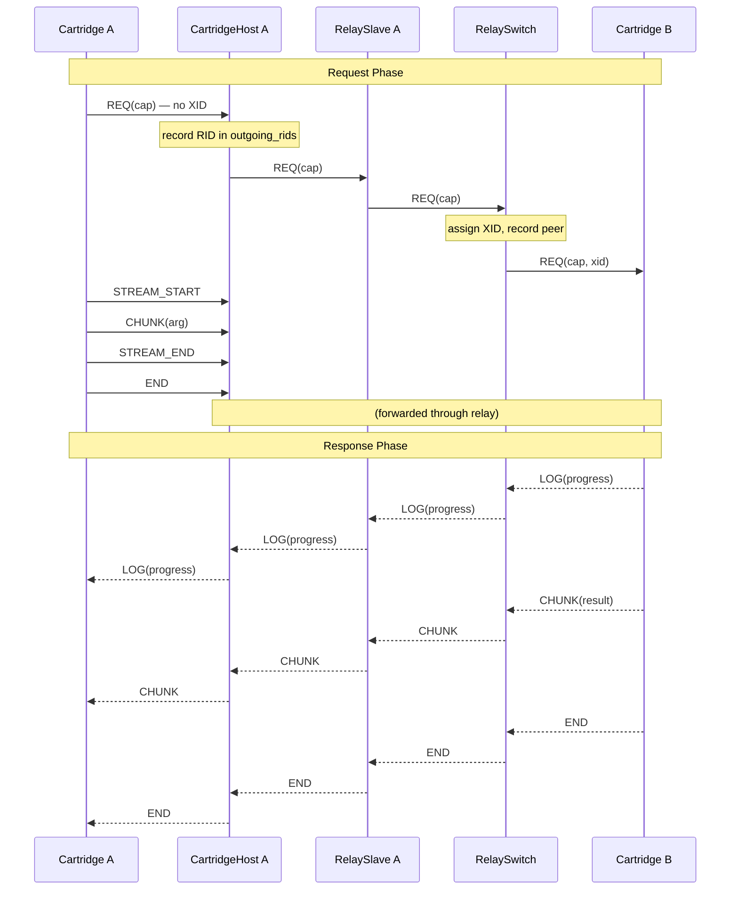

# Peer Invocation

How a cartridge calls another cartridge's cap during request handling.

## Concept

A cartridge handling a request can invoke a capability provided by a different cartridge. The calling cartridge does not know or care which cartridge provides the target cap — the RelaySwitch handles routing based on cap URN matching.

The most common use case is ML cartridges calling `modelcartridge` to download model files before loading them. The model cartridge handles HTTP downloads, caching, and progress reporting. The ML cartridge just calls the download cap and receives the file path.

Peer invocations happen during handler execution, not before or after. The handler is mid-request, needs something from another cartridge, calls it, waits for the response, and continues.

Source: `capdag/src/bifaci/cartridge_runtime.rs` (PeerInvoker trait, line 728).

## PeerInvoker Trait

Handlers access peer invocation through the `PeerInvoker` trait, obtained via `req.peer()`:

```rust
#[async_trait]
pub trait PeerInvoker: Send + Sync {
    fn call(&self, cap_urn: &str) -> Result<PeerCall, RuntimeError>;

    async fn call_with_bytes(
        &self,
        cap_urn: &str,
        args: &[(&str, &[u8])],
    ) -> Result<PeerResponse, RuntimeError>;
}
```

**`call(cap_urn)`** opens a new peer invocation. Returns a `PeerCall` handle for sending arguments. The REQ frame is sent immediately with the given cap URN.

**`call_with_bytes(cap_urn, args)`** is a convenience method that combines the entire sequence: opens the call, creates one stream per argument, writes the bytes, closes each stream, sends END, and returns the `PeerResponse`. Each element of `args` is a `(media_urn, data)` pair.

```rust
// Convenience: one call, automatic stream management
let response = req.peer()
    .call_with_bytes("cap:in=...;out=...;download", &[
        ("media:model-spec;textable", model_spec.as_bytes()),
    ])
    .await?;
let model_path = response.collect_bytes().await?;
```

## PeerCall

`PeerCall` is the handle for building a multi-argument peer invocation step by step:

```rust
pub struct PeerCall {
    sender: Arc<dyn FrameSender>,
    request_id: MessageId,
    max_chunk: usize,
    response_rx: Option<mpsc::UnboundedReceiver<Frame>>,
}
```

**`arg(media_urn)`** creates an `OutputStream` for one argument. Each arg is an independent stream with its own UUID stream_id. The caller writes data to the stream and closes it:

```rust
let call = req.peer().call("cap:in=...;out=...;something")?;
let arg1 = call.arg("media:text;encoding=utf8");
arg1.write(prompt.as_bytes())?;
arg1.close()?;

let arg2 = call.arg("media:binary");
arg2.write(&image_bytes)?;
arg2.close()?;

let response = call.finish().await?;
```

**`finish()`** sends the END frame for the peer request, starts the response demux, and returns a `PeerResponse`. After calling `finish()`, no more arguments can be sent. Calling `finish()` twice returns an error.

Source: `cartridge_runtime.rs:672`.

## PeerResponse

`PeerResponse` yields both data chunks and LOG frames from the peer, interleaved in arrival order:

```rust
pub struct PeerResponse {
    rx: mpsc::UnboundedReceiver<PeerResponseItem>,
}
```

**`recv()`** returns the next item — either data or a log message. Returns `None` when the response ends.

**`collect_bytes()`** accumulates all `Data` items into a byte vector, silently discarding `Log` items. Use this when you only care about the result.

**`collect_value()`** returns the first `Data` item as a CBOR value, silently discarding `Log` items.

### PeerResponseItem

```rust
pub enum PeerResponseItem {
    Data(Result<ciborium::Value, StreamError>),
    Log(Frame),
}
```

- **`Data`**: A decoded CBOR chunk from the peer's response stream. Bytes, text, or other CBOR types.
- **`Log`**: A raw LOG frame from the peer. Carries progress updates, status messages, and diagnostic information. LOG frames are delivered in real time as they arrive — they are not buffered until data starts.

Source: `cartridge_runtime.rs:200`.

## Forwarding Peer Progress

When a handler invokes a peer (e.g., model download), it typically wants to forward the peer's progress updates to its own progress stream, mapped into the appropriate range. The standard pattern:

```rust
let response = call.finish().await?;
while let Some(item) = response.recv().await {
    match item {
        PeerResponseItem::Data(Ok(value)) => {
            data.extend(extract_bytes(&value));
        }
        PeerResponseItem::Log(frame) => {
            if let Some(peer_progress) = frame.log_progress() {
                // Map peer's [0.0, 1.0] into our [0.0, 0.25] range
                let mapped = peer_progress * 0.25;
                req.output().progress(mapped, frame.log_message().unwrap_or(""));
            }
        }
        PeerResponseItem::Data(Err(e)) => return Err(e.into()),
    }
}
// Continue with our own work at progress 0.25+
req.output().progress(0.25, "Model downloaded, loading...");
```

The `map_progress` function in `capdag/src/orchestrator/types.rs` provides a general version: `map_progress(value, base, weight)` maps a `[0.0, 1.0]` value into `[base, base + weight]`.

Handlers typically reserve the first portion of their progress range for peer calls (e.g., [0.0, 0.25] for model download) and use the rest for their own work (e.g., [0.25, 1.0] for inference).

## Frame Flow During Peer Call

At the protocol level, peer invocation involves multiple components:



Key points:

1. Cartridge A sends REQ without XID — cartridges don't know about routing IDs.
2. CartridgeHostRuntime A records the request's RID in `outgoing_rids` to know where to route the response.
3. The RelaySwitch assigns an XID and records the peer request in `peer_requests`.
4. LOG frames from Cartridge B flow back through the same path. CartridgeHostRuntime A routes them to Cartridge A's PeerResponse channel by matching the RID in `outgoing_rids`.
5. The response (CHUNK, END) follows the same routing path back to Cartridge A.

Source: `host_runtime.rs` (`outgoing_rids`), `relay_switch.rs` (`peer_requests`), `cartridge_runtime.rs`.

## NoPeerInvoker

`NoPeerInvoker` is a stub that rejects all peer calls with an error. It is used in CLI mode (where there is no host to route through) and in tests that do not need peer invocation.

```rust
pub struct NoPeerInvoker;

impl PeerInvoker for NoPeerInvoker {
    fn call(&self, _cap_urn: &str) -> Result<PeerCall, RuntimeError> {
        Err(RuntimeError::PeerRequest(
            "Peer invocation not supported in this context".to_string(),
        ))
    }
}
```

Source: `cartridge_runtime.rs:753`.

## Swift Equivalent

The Swift implementation in `capdag-objc/Sources/Bifaci/CartridgeRuntime.swift` provides:

- `PeerInvoker` as a Swift protocol (equivalent to the Rust trait).
- `PeerCall` and `PeerResponse` with the same semantics but Swift-idiomatic APIs.
- `invoke(capUrn:args:)` as the convenience method (equivalent to `call_with_bytes`).
- Response items delivered as Swift enum cases rather than Rust enum variants.

The frame flow and routing behavior are identical — the protocol-level semantics do not differ between implementations.
