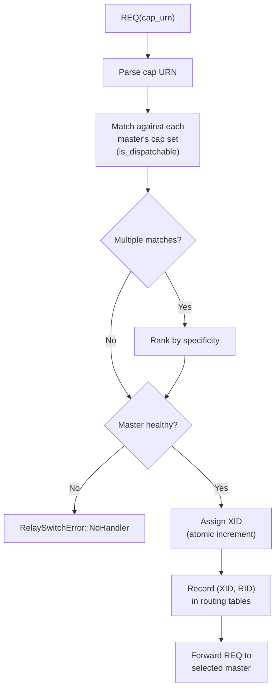

# Relay Switch

Cap-aware routing multiplexer that sits between the engine and relay masters.

## RelaySwitch

The `RelaySwitch` is the central routing component of the capdag network. It connects to one or more RelaySlave/RelayMaster pairs (each backed by a CartridgeHostRuntime managing one or more cartridges) and routes requests to the correct master based on cap URN matching.

All methods take `&self` (not `&mut self`). Interior mutability (`RwLock`, `Mutex`, `AtomicU64`, `AtomicBool`) allows multiple concurrent DAG executions to route frames through the switch simultaneously.

```rust
pub struct RelaySwitch {
    masters: RwLock<Vec<MasterConnection>>,
    cap_table: RwLock<Vec<(String, usize)>>,          // cap_urn → master index
    request_routing: RwLock<HashMap<(MessageId, MessageId), RoutingEntry>>,
    peer_requests: RwLock<HashSet<(MessageId, MessageId)>>,
    rid_to_xid: RwLock<HashMap<MessageId, MessageId>>, // RID → XID
    origin_map: RwLock<HashMap<(MessageId, MessageId), Option<usize>>>,
    external_response_channels: RwLock<HashMap<(MessageId, MessageId), mpsc::UnboundedSender<Frame>>>,
    xid_counter: AtomicU64,
    live_cap_graph: RwLock<LiveCapGraph>,
    cap_registry: Arc<CapRegistry>,
    // ...
}
```

Source: `capdag/src/bifaci/relay_switch.rs:177`.

## Initialization

Creating a `RelaySwitch` involves two phases:

**Phase 1 — Verify each master**:

For each Unix socket connection:
1. Split into read/write halves.
2. Read the first frame — must be a RelayNotify carrying the host's aggregate manifest and limits.
3. Run identity verification: send REQ for CAP_IDENTITY with nonce, verify echo response.
4. During verification, additional RelayNotify frames may arrive (as CartridgeHostRuntime discovers and connects its cartridges). These update the master's manifest.
5. Stash the reader for phase 2.

**Phase 2 — Spawn readers**:

After all masters are verified, spawn a reader task (`tokio::spawn`) for each master. These tasks read frames from the socket and send them through an `mpsc` channel to the switch's routing logic.

This two-phase design ensures that identity verification runs sequentially per master (no reader task interference) while reader tasks start only after the entire switch is verified.

Source: `relay_switch.rs` (`RelaySwitch::new`, line 230).

## Cap Routing



When a REQ frame arrives (from the engine or from a peer cartridge), the switch routes it:

1. **Parse** the `cap` field (key 10) as a cap URN.
2. **Match** against each master's capability set using `is_dispatchable(provider, request)` (see [../07-DISPATCH.md](../07-DISPATCH.md)). The provider's cap URN must accept the request's input type (contravariant) and produce a compatible output type (covariant).
3. **Rank** if multiple masters match. Specificity ranking (see [../08-RANKING.md](../08-RANKING.md)) selects the most specific provider.
4. **Skip unhealthy masters** — masters marked unhealthy are excluded from routing.
5. **Assign XID**: Atomically increment the `xid_counter` and assign the new value as the request's `routing_id`.
6. **Record routing**: Store `(XID, RID) → RoutingEntry` in `request_routing` and `RID → XID` in `rid_to_xid`.
7. **Forward**: Send the REQ (with XID) to the selected master's socket writer.

If no healthy master can handle the cap, the switch returns `RelaySwitchError::NoHandler`.

Source: `relay_switch.rs`.

## XID Assignment

XIDs (routing IDs, key 13 in frames) are unsigned integers assigned by the RelaySwitch at routing boundaries. They serve a single purpose: letting the switch route continuation frames to the correct master.

- **Incoming REQ from engine**: Has no XID. The switch assigns one and records the mapping.
- **Continuation frames** (CHUNK, STREAM_START, etc.): Carry the XID from the original REQ. The switch looks up `(XID, RID)` in `request_routing` to find the destination.
- **Response frames from master**: Carry the XID. The switch uses `origin_map` to determine where to send them (back to the engine or to the requesting cartridge's master).

Cartridges never see XIDs directly — they are purely infrastructure. A cartridge's REQ has no XID; the CartridgeHostRuntime forwards it, and the switch adds one.

Source: `relay_switch.rs`, `frame.rs` (`routing_id` field).

## Peer Request Routing

When Cartridge A calls a cap provided by Cartridge B:

1. Cartridge A's REQ arrives at the switch (via CartridgeHostRuntime → RelaySlave → RelayMaster) without an XID.
2. The switch assigns an XID and routes to Cartridge B's master using the same cap matching logic.
3. The (XID, RID) pair is added to `peer_requests` for special cleanup tracking.
4. The `origin_map` records that this request came from Cartridge A's master index (not from the engine).
5. Response frames from Cartridge B flow back through the switch to Cartridge A's master.

The cleanup semantics for peer requests differ from engine-initiated requests: the switch must wait for the full response (Cartridge B's END) before cleaning up, because the response needs to reach Cartridge A.

Source: `relay_switch.rs`.

## Request Tracking

The switch maintains several routing tables:

| Table | Key | Value | Purpose |
|-------|-----|-------|---------|
| `request_routing` | (XID, RID) | `RoutingEntry` (source + dest master) | Route continuation frames to the right master. |
| `rid_to_xid` | RID | XID | Look up the XID for a request that only has a RID (continuation frames). |
| `peer_requests` | (XID, RID) | (set membership) | Track which requests are peer invocations (for cleanup). |
| `origin_map` | (XID, RID) | `Option<usize>` (master index or None) | Track where response frames should go back to. `None` = external caller (engine). |
| `external_response_channels` | (XID, RID) | `mpsc::UnboundedSender<Frame>` | For `execute_cap` calls: deliver response frames to the calling code. |

Terminal frames (END, ERR) trigger cleanup: the (XID, RID) pair is removed from all tables.

Source: `relay_switch.rs`.

## Dynamic Master Addition

`add_master()` connects a new master at runtime:

1. Accept a new Unix socket connection.
2. Read RelayNotify, perform identity verification.
3. Spawn a reader task.
4. Merge the new master's capabilities into the aggregate cap table.
5. Rebuild the `LiveCapGraph` for path finding.

This enables hot-plugging of new hosts without restarting the switch.

Source: `relay_switch.rs`.

## Master Health

Each master tracks its health status:

```rust
pub struct MasterHealthStatus {
    pub index: usize,
    pub healthy: bool,
    pub cap_count: usize,
    pub connected_seconds: u64,
    pub last_error: Option<String>,
}
```

A master becomes unhealthy when:
- Its reader task encounters an I/O error (socket closed, CBOR decode failure).
- Identity verification fails during initialization.

Unhealthy masters are excluded from cap routing — their capabilities are not considered when matching REQ frames. The `healthy` flag is an `AtomicBool` on `MasterConnection`, checked during every routing decision.

Source: `relay_switch.rs` (`MasterHealthStatus`, `MasterConnection::healthy`).

## Capability Aggregation

`capabilities()` returns the union of all healthy masters' capabilities as an aggregate JSON manifest. This is the engine's view of what the entire cartridge network can do.

The switch also exposes:
- `get_reachable_targets()` — queries the `LiveCapGraph` to find which output media URNs are reachable from a given input.
- `find_paths_to_exact_target()` — finds machines that transform an input into a specific output.

These methods are used by the planner (see [15.4-PLANNER.md](15.4-PLANNER.md)) to find execution paths through the capability graph.

Source: `relay_switch.rs`.

## Swift Equivalent

The `RelaySwitch` class in `capdag-objc/Sources/Bifaci/RelaySwitch.swift` provides the same routing behavior for Swift-based engine hosts. The routing semantics (cap matching, XID assignment, peer tracking) are identical.
