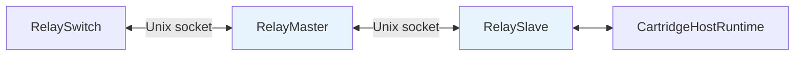
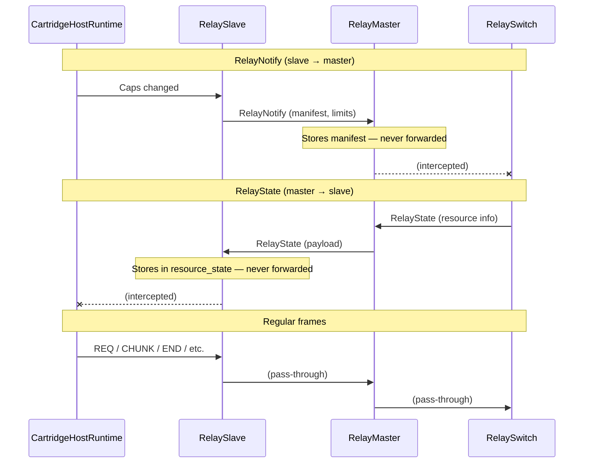
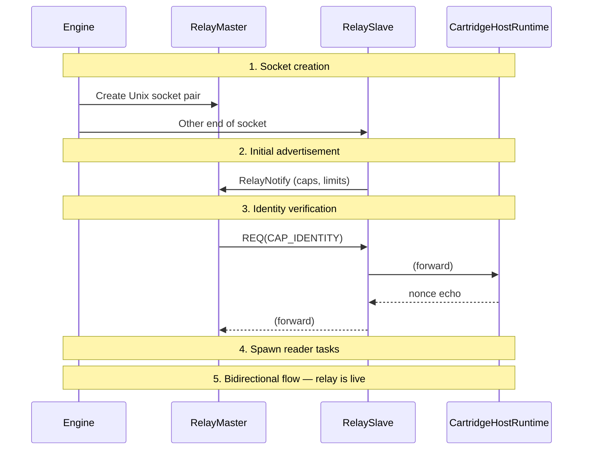
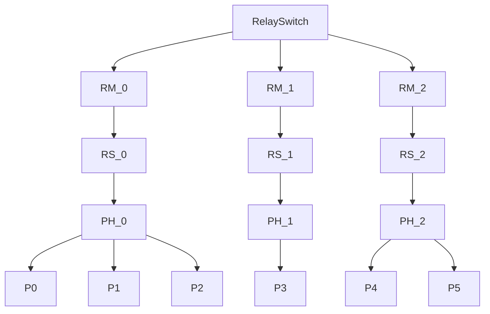

# Relay Topology

RelaySlave, RelayMaster, and how relay chains connect components.

## Relay Pair

A RelaySlave/RelayMaster pair forms a transparent frame bridge over a Unix socket. The pair connects a CartridgeHostRuntime (managing cartridge processes) to the RelaySwitch (routing cap invocations).



All regular frames pass through unchanged. Only two frame types are intercepted — RelayNotify and RelayState — which carry control information between the switch and the host.

Source: `capdag/src/bifaci/relay.rs`.

### RelaySlave

`RelaySlave` sits at the CartridgeHostRuntime end of the Unix socket. It runs two concurrent tasks:

**Task 1 (socket → local)**: Reads frames from the socket (sent by the RelaySwitch via the master). Intercepts RelayState frames and stores their payload. Forwards all other frames to the local CartridgeHostRuntime. Applies a `ReorderBuffer` to ensure frames arrive in sequence order.

**Task 2 (local → socket)**: Reads frames from the CartridgeHostRuntime. Drops any RelayState frames (cartridges must not originate these). Forwards everything else to the socket.

The slave can also inject RelayNotify frames into the socket stream on demand — triggered when the CartridgeHostRuntime's capability set changes.

```rust
pub struct RelaySlave<R: AsyncRead + Unpin, W: AsyncWrite + Unpin> {
    local_reader: FrameReader<R>,
    local_writer: FrameWriter<W>,
    resource_state: Arc<Mutex<Vec<u8>>>,
}
```

The `resource_state` is shared with the CartridgeHostRuntime via `resource_state_handle()`, giving the host access to the latest RelayState payload (model paths, GPU info, etc.).

Source: `relay.rs` (RelaySlave, line 25).

### RelayMaster

`RelayMaster` sits at the RelaySwitch end of the Unix socket. During initialization, the RelaySwitch reads the first frame from the socket — a RelayNotify from the slave advertising its capabilities and limits.

After initialization, the RelaySwitch's reader task reads frames directly from the master's socket. The master stores the latest manifest and limits, which the switch queries for routing decisions.

The master also applies a `ReorderBuffer` and exposes methods for sending frames (send_state for RelayState) and reading frames (read_frame, which intercepts control frames and delivers only data frames).

Source: `relay.rs`.

## Frame Interception



### RelayNotify (Slave → Master)

RelayNotify frames carry capability advertisements from the slave's host to the switch. They contain:

- **manifest** (bytes): JSON-encoded aggregate manifest of all cartridges on the host.
- **max_frame**, **max_chunk**, **max_reorder_buffer**: Protocol limits.

When a CartridgeHostRuntime rebuilds its capability set — because a cartridge was added, died, or respawned — it sends a RelayNotify through the RelaySlave. The slave forwards it to the socket. The switch reads it and updates the master's stored manifest and the aggregate cap table.

RelayNotify frames never leak through the relay to the opposite side. The slave's Task 1 ignores incoming RelayNotify (from the socket), and the switch never sees them in its regular frame routing — they are consumed during initialization and by the reader task.

### RelayState (Master → Slave)

RelayState frames carry host resource information from the engine to the host process. The payload is opaque (CBOR or JSON) and can contain:

- macOS security bookmarks for file access.
- GPU/accelerator availability.
- Configuration settings.
- Capability demands (what the engine needs from this host).

The engine sends RelayState through the switch to a specific master's socket. The slave intercepts it in Task 1 (socket → local) and stores the payload in `resource_state`. The CartridgeHostRuntime reads this shared state and passes relevant information to cartridges.

RelayState frames never reach the CartridgeHostRuntime as frames — they are intercepted and stored.

## Connection Lifecycle



1. **Socket creation**: The engine creates a Unix socket pair (or equivalent IPC channel).
2. **Endpoint assignment**: One end goes to the RelaySlave (in the CartridgeHostRuntime's process), the other to the RelaySwitch (in the engine's process).
3. **Initial advertisement**: The RelaySlave sends a RelayNotify on startup, advertising its host's capabilities and limits. This is triggered by `run()` with an `initial_notify` parameter.
4. **Identity verification**: The RelaySwitch reads the RelayNotify, then runs identity verification through the relay chain (REQ for CAP_IDENTITY flows through the slave, to the CartridgeHostRuntime, to a cartridge, and the echo response flows back).
5. **Reader tasks**: After verification, both sides spawn reader tasks for ongoing frame forwarding.
6. **Bidirectional flow**: The relay is now live. Regular frames flow in both directions. RelayNotify and RelayState frames are exchanged as needed.
7. **Shutdown**: When either side closes the socket, the other side's reader task detects EOF and shuts down.

Source: `relay.rs`, `relay_switch.rs`.

## Multiple Masters

A RelaySwitch manages an array of masters, each connected to a different host:



Each master provides a different set of capabilities (though overlap is possible). The switch aggregates all capabilities into a single cap table and routes each REQ to the master whose cartridges can best handle the requested cap — using `is_dispatchable` matching and specificity ranking across all masters.

Masters are independent. A failure in one does not affect the others. The switch marks the failed master as unhealthy and continues routing to the remaining healthy masters.

Source: `relay_switch.rs`.

## Swift Equivalent

`Relay.swift` and `RelaySwitch.swift` in `capdag-objc/Sources/Bifaci/` provide the same relay topology for Swift-based hosts. The frame interception rules (RelayNotify and RelayState) and the transparent forwarding behavior are identical.
