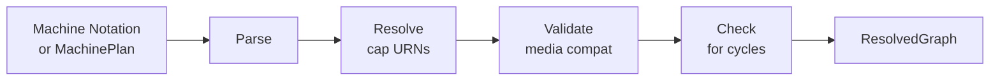
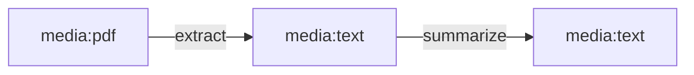

# Orchestrator

Machine notation parsing, DAG construction, and cap resolution.

## Overview

The orchestrator bridges textual DAG descriptions and the execution engine. It takes either a machine notation string (from the machine module) or a `MachinePlan` (from the planner) and produces a `ResolvedGraph` — a validated DAG with concrete cap definitions, media types, and wiring — ready for execution.



The pipeline: parse → resolve cap URNs → validate media compatibility → check for cycles → produce `ResolvedGraph`.

Source: `capdag/src/orchestrator/`.

## Machine Notation

Machine notation is a compact text format for describing transformation pipelines. Each notation defines named steps bound to cap URNs and wiring describing how data flows between them.

The grammar is defined as a PEG in `capdag/src/route/machine.pest` and parsed by `capdag/src/route/parser.rs`.

### Syntax

Step declarations bind an alias to a cap URN:

```
[extract cap:in="media:pdf";out="media:record";extract;target=metadata]
```

Wiring declares data flow between steps, with source and target as media URNs:

```
[media:pdf -> extract -> media:record]
```

A linear chain:

```
[media:pdf -> extract -> media:text;encoding=utf8 -> summarize -> media:text;encoding=utf8]
```



Fan-in (multiple sources into one step):

```
[media:image -> describe -> media:text;encoding=utf8]
[media:text;encoding=utf8 -> describe]
```

Source: `capdag/src/route/parser.rs`, `route.pest`.

### Alias Rules

Aliases must start with an alphabetic character or underscore — no leading digits. If no alias is specified in the notation, one is auto-generated from the `op=` tag value. Aliases must be unique within a notation; duplicates produce a `DuplicateAlias` error.

Source: `capdag/src/route/parser.rs`.

## Parsing Pipeline

`parse_machine_to_cap_dag()` converts machine notation into a `ResolvedGraph`:

1. **Parse** the notation into a `Machine` graph (machine module). This produces nodes (media URN endpoints) and edges (cap invocations).
2. **Resolve cap URNs**: For each edge, look up the cap URN in the `CapRegistry` to get the full `Cap` definition with arguments, metadata, and validated URN structure.
3. **Validate media compatibility**: Check that each node's media URN is consistent across all edges connecting to it. A node that is both the output of one cap (producing `media:text`) and the input of another (expecting `media:pdf`) is a conflict.
4. **Check for cycles**: Verify the graph is a DAG. Cycles produce a `NotADag` error listing the involved nodes.
5. **Return** the `ResolvedGraph`.

Source: `capdag/src/orchestrator/parser.rs`.

## ResolvedGraph

A `ResolvedGraph` is the validated, executable DAG:

```rust
pub struct ResolvedGraph {
    pub nodes: HashMap<String, String>,   // node name → media URN
    pub edges: Vec<ResolvedEdge>,          // cap invocations
    pub graph_name: Option<String>,
}
```

Nodes represent data at a specific point in the pipeline, identified by a media URN. Edges represent cap invocations that transform data from one node to another.

Source: `capdag/src/orchestrator/types.rs:88`.

### ResolvedEdge

```rust
pub struct ResolvedEdge {
    pub from: String,       // source node name
    pub to: String,         // target node name
    pub cap_urn: String,    // resolved cap URN string
    pub cap: Cap,           // full cap definition
    pub in_media: String,   // input media URN
    pub out_media: String,  // output media URN
}
```

Each edge carries the full `Cap` definition, which includes the cap's arguments, metadata (activity timeout overrides, etc.), and validated URN. This avoids re-resolving during execution.

Source: `types.rs:70`.

## Plan Converter

`plan_to_resolved_graph()` converts a `MachinePlan` (from the planner module) into a `ResolvedGraph` (for the executor). The conversion maps plan node types to graph elements:

| Plan node type | Graph element |
|----------------|---------------|
| **InputSlot** | Source data node. |
| **Cap** | Edge (cap invocation from input node to output node). |
| **Output** | Terminal data node. |
| **WrapInList** | Transparent pass-through — resolved at conversion time, not at execution time. |
| **ForEach / Collect / Merge / Split** | **Rejected**. These must be decomposed before conversion. The executor handles only flat DAGs. |

Source: `capdag/src/orchestrator/plan_converter.rs`.

## Validation

Validation happens at two levels:

- **Resolver-level** (inside `Machine::from_string`): cycle detection via Kahn's algorithm, source-to-cap-arg matching, unknown cap rejection. These run per-strand during anchor realization (see [09-MACHINE-NOTATION](./09-MACHINE-NOTATION.md) §7 and §12).
- **Orchestrator-level** (inside `parse_machine_to_cap_dag`): media-type compatibility and structure-mismatch checks (record vs opaque, from [11-MEDIA-URNS](./11-MEDIA-URNS.md)) at each node. These run after the resolved Machine is built and its edges are walked.

The orchestrator does NOT run a separate cycle pass — the resolver's per-strand Kahn check is authoritative. Cycles surface as `NotADag` after translation from `CyclicMachineStrand`.

## Error Types

```rust
pub enum ParseOrchestrationError {
    MachineSyntaxParseFailed(String),     // machine notation parse failed
    CapNotFound { cap_urn: String },       // cap URN not in registry
    NodeMediaConflict { node, existing, required_by_cap }, // conflicting media URNs
    NotADag { cycle_nodes: Vec<String> },  // graph has a cycle
    InvalidGraph { message: String },       // unsupported control-flow nodes
    CapUrnParseError(String),
    MediaUrnParseError(String),
    RegistryError(String),
    StructureMismatch { node, source_structure, expected_structure },
}
```

All errors are descriptive and include the node names or URNs involved. There are no catch-all variants.

Source: `types.rs:15`.

## Swift Equivalent

The Swift orchestrator in `capdag-objc/Sources/Bifaci/Orchestrator/` includes `OrchestratorParser.swift` and `PlanConverter.swift`. The Swift version uses a DOT graph parser (`DotParser.swift`) rather than the PEG-based machine notation parser — the input format differs but the resolution pipeline (cap lookup, media validation, cycle check) is the same.
