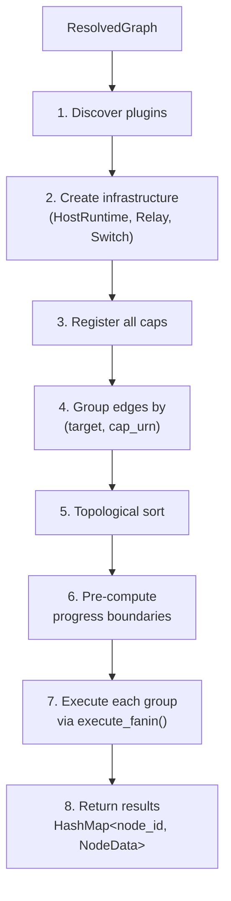
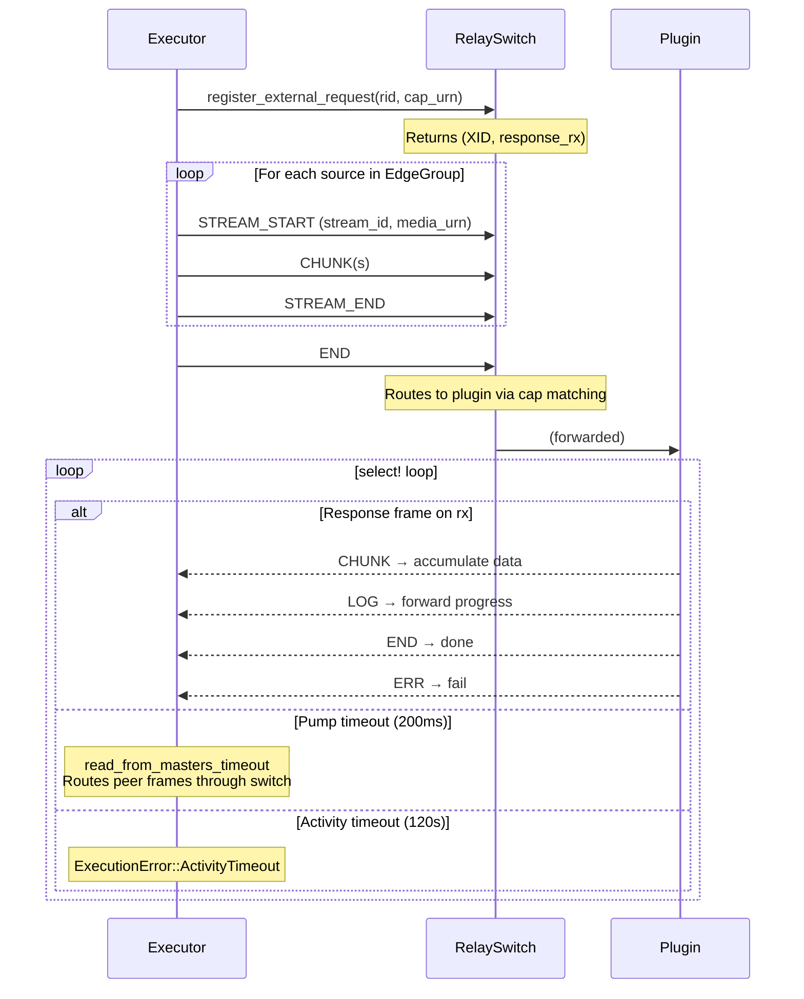

# Execution

How the executor runs a ResolvedGraph: plugin discovery, edge grouping, topological ordering, and the execute_fanin loop.

## execute_dag



`execute_dag()` is the top-level function that takes a `ResolvedGraph` and runs it:

1. **Discover plugins**: Collect all unique cap URNs from the graph's edges. For each, find a plugin binary that provides it.
2. **Create infrastructure**: Set up a PluginHostRuntime, RelaySlave/RelayMaster pair, and RelaySwitch.
3. **Register all caps**: Register ALL manifest caps from each plugin with the switch — not just the ones referenced by the DAG. This is necessary because plugins may make peer invocations to caps that are not in the DAG but are in another plugin's manifest.
4. **Group edges**: Group edges by `(target_node, cap_urn)` into `EdgeGroup`s.
5. **Topological sort**: Order groups by dependency so each group executes only after its inputs are available.
6. **Pre-compute progress**: Calculate progress boundaries for each group.
7. **Execute sequentially**: Run each group via `execute_fanin()`.
8. **Return results**: A `HashMap<node_id, NodeData>` with the output data from each node.

Source: `capdag/src/orchestrator/executor.rs`.

## Plugin Discovery

Plugin resolution for each cap URN in the graph:

1. **Dev plugins** (local override): Check `dev_plugins` — a map of local binary paths — using `is_dispatchable` matching. This lets developers test local builds without publishing.
2. **Plugin registry** (remote): Fall back to the plugin registry for published plugins.
3. **Download and verify**: If the binary is not cached locally, download it and verify its SHA256 hash.
4. **Register**: Add the plugin binary to the PluginHostRuntime.

All manifest caps are registered because peer invocations from one plugin may target caps in another plugin that are not part of the DAG. For example, an ML cartridge's handler may call `modelcartridge` to download a model — this cap is not in the DAG but must be routable.

Source: `executor.rs`.

## Edge Grouping

Multiple edges targeting the same `(to_node, cap_urn)` are grouped into a single `EdgeGroup`. Each group represents one cap invocation, potentially with multiple input streams (fan-in).

For example, a cap that accepts both a PDF document and a prompt string has two edges pointing to the same target node — these become one EdgeGroup with two source streams.

Each source in the group becomes a separate STREAM_START/CHUNK/STREAM_END sequence within the single request.

Source: `executor.rs`.

## Topological Sort

Edge groups are sorted using Kahn's algorithm so that a group executes only after all groups whose output nodes it depends on have completed.

Groups at the same topological depth have non-deterministic relative ordering. The algorithm processes nodes without incoming dependencies first, removes their outgoing edges, and repeats until all groups are ordered.

Source: `executor.rs`.

## execute_fanin

`execute_fanin()` is the core function that executes a single cap invocation:

### Input Collection

For each source node in the edge group, look up its data in the `node_data` map. If any source is missing, fail with `ExecutionError::NoIncomingData`. Source data was produced by an earlier group's execution.



### Cap Invocation

1. Call `RelaySwitch::register_external_request(rid, cap_urn)` to set up routing. Returns `(XID, response_rx)` — the XID for frame routing and an `mpsc` channel for receiving response frames.
2. Send input streams: For each source, send STREAM_START (with stream_id and media_urn) → CHUNK(s) (with payload split at max_chunk boundaries) → STREAM_END.
3. Send END to signal all inputs are delivered.

### Response Collection Loop

The response is collected with a `tokio::select!` loop that does two things concurrently:

```rust
tokio::select! {
    pump_result = read_from_masters_timeout(200ms) => {
        // Route peer frames through the RelaySwitch
    }
    Some(frame) = rx.recv() => {
        last_activity = Instant::now();  // reset timeout
        match frame.frame_type {
            Chunk => { /* accumulate response data */ }
            End   => { /* response complete */ }
            Log   => { /* forward progress to callback */ }
            Err   => { /* execution failed */ }
        }
    }
}
```

The **concurrent pump** (`read_from_masters_timeout`) is necessary. Without it, a plugin doing a peer call during request handling would deadlock: the peer request frames would arrive at the switch but have no path to the target plugin, because the executor's response loop is only reading its own response channel, not pumping frames through the switch.

The 200ms timeout on `read_from_masters_timeout` ensures the loop checks both the response channel and the frame pump regularly.

### Activity Timeout

`DEFAULT_ACTIVITY_TIMEOUT_SECS = 120`. Any frame received on `rx.recv()` resets `last_activity`. If no frame arrives for 120 seconds, the executor aborts with `ExecutionError::ActivityTimeout`.

While idle, the executor logs a warning every 30 seconds to aid debugging.

Individual caps can override the default timeout via the `activity_timeout_secs` key in their metadata. This is checked before the default is applied.

Source: `executor.rs` (`DEFAULT_ACTIVITY_TIMEOUT_SECS`, `ACTIVITY_TIMEOUT_METADATA_KEY`).

## Progress Subdivision

Before execution, the executor pre-computes progress boundaries for each group:

```
boundaries[i] = i as f32 / n_groups as f32
```

Group `i` maps its progress to the range `[boundaries[i], boundaries[i+1])`. The `CapProgressFn` callback passed to `execute_fanin` wraps the plugin's raw [0.0, 1.0] progress with `map_progress(child, base, weight)` where `base = boundaries[i]` and `weight = 1.0 / n_groups`.

This gives each group an equal share of the overall [0.0, 1.0] range. See [15.3-PROGRESS-MAPPING.md](15.3-PROGRESS-MAPPING.md) for the mapping formula.

## Error Handling

```rust
pub enum ExecutionError {
    PluginNotFound(String),        // no plugin provides the cap
    ActivityTimeout { cap_urn, seconds }, // no frames for > timeout
    PluginExecutionFailed { cap_urn, code, message }, // plugin returned ERR
    NoIncomingData { node },       // missing source node data
    IoError(String),
    HostError(String),
    RegistryError(String),
}
```

All errors are terminal for the DAG execution. There is no retry logic — the caller decides whether to retry.

## Concurrent Execution

The current executor processes edge groups sequentially within a DAG. Groups at the same topological depth could theoretically run in parallel. The `Arc<RelaySwitch>` design supports this — interior mutability and shared routing tables allow concurrent `execute_fanin` calls. However, parallel execution is not yet implemented.
