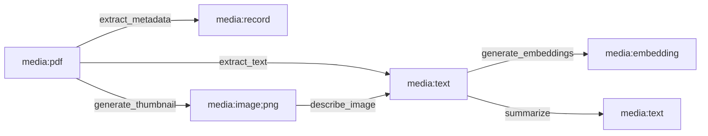
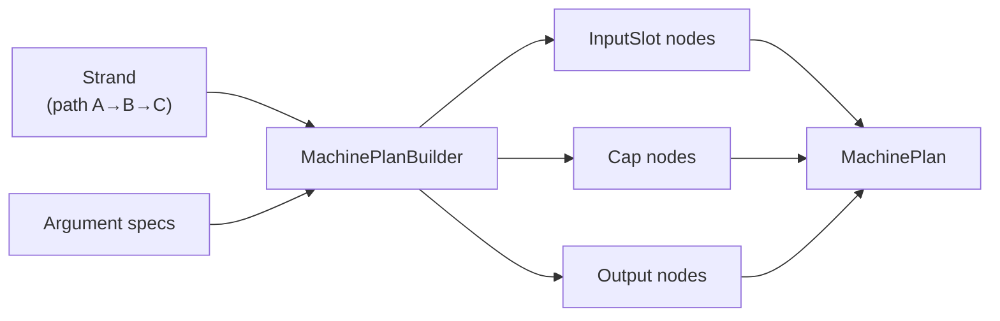
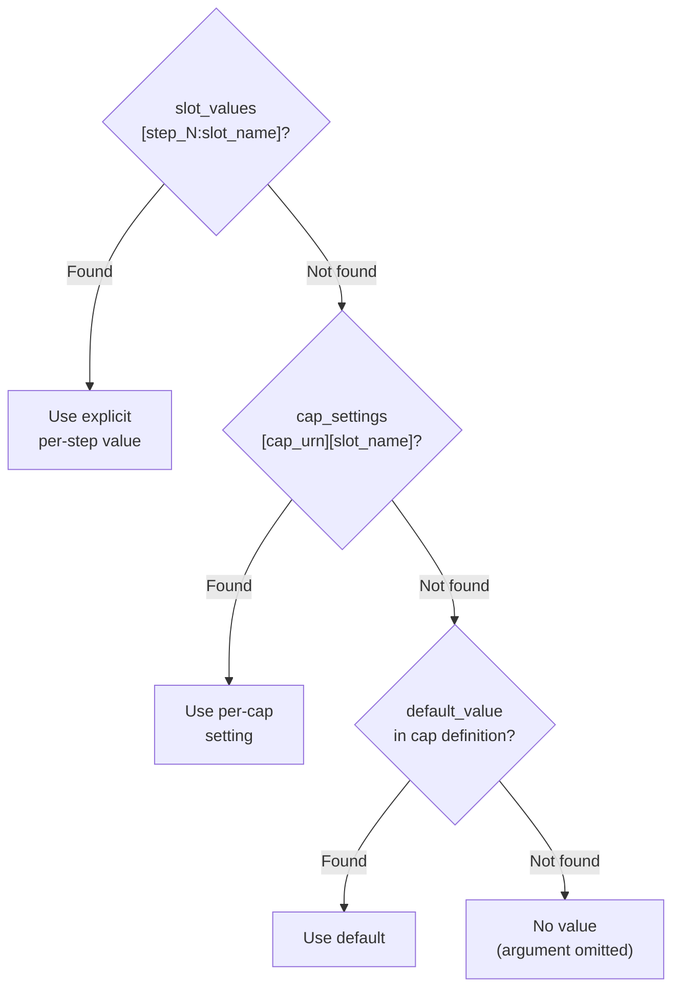

# Planner

Path finding, plan construction, and execution for multi-step transformations.

## Overview

The planner module discovers transformation paths automatically. Given a source media type and a target media type, it finds a sequence of caps that transforms the data — without the user specifying the intermediate steps.

This is different from the orchestrator (see [15.1-ORCHESTRATOR.md](15.1-ORCHESTRATOR.md)), which takes an explicit DAG description. The planner builds the DAG by searching the capability graph.

Source: `capdag/src/planner/`.

## LiveCapFab



The `LiveCapFab` is a directed graph where nodes are media URNs and edges are capabilities. When a cap is registered with input URN `A` and output URN `B`, the graph gains an edge `A → B` labeled with that cap.

Path finding traverses this graph to discover multi-step transformation chains: if there is a cap `A → B` and a cap `B → C`, then the input type `A` can reach the output type `C` via a two-step chain.

Source: `capdag/src/planner/live_cap_graph.rs`.

### Reachable Targets

`get_reachable_targets()` returns all media types reachable from a given source via one or more cap invocations. It performs a breadth-first traversal of the graph starting from the source node and collecting all reachable nodes.

This is used by the UI to show what transformations are available for a given input file — "you can extract metadata, generate a thumbnail, create embeddings, ..." without enumerating every possible path.

Each result is a `ReachableTargetInfo` containing the target media URN and the machine needed to reach it.

### Path Finding

`find_paths_to_exact_target()` returns one or more `Strand` objects connecting a specific source to a specific target. Each strand is a concrete path through the capability graph.

When multiple paths exist (e.g., PDF → text via extraction, or PDF → image → text via OCR), all valid paths are returned. The caller chooses which to execute based on preference or context.

Source: `live_cap_graph.rs`.

## Strand

A `Strand` is an ordered list of `StrandStep`s representing a path through the capability graph:

```
[source] --cap_1--> [intermediate_1] --cap_2--> [intermediate_2] --cap_3--> [target]
```

### StrandStep

Each step names the cap to invoke and the media types at its boundaries:

- `cap_urn`: The cap URN to invoke at this step.
- `in_media`: The media URN of the input to this step.
- `out_media`: The media URN of the output from this step.

The first step's `in_media` is the source; the last step's `out_media` is the target. Adjacent steps connect: step N's `out_media` is step N+1's `in_media`.

Source: `live_cap_graph.rs`.

## Cardinality Analysis

The cardinality module determines the shape of data flowing through the plan:

**InputCardinality**: Is the data a single item or a list?
- `Single`: One value (e.g., `media:pdf` — one PDF document).
- `Sequence`: Multiple values (e.g., `media:pdf;list` — a list of PDF documents). The `list` marker tag in the media URN signals this.

**InputStructure**: Is the data opaque or structured?
- `Opaque`: Raw bytes with no internal structure (e.g., `media:binary`).
- `Record`: A structured record with named fields (e.g., `media:record`). The `record` marker tag signals this.

**MediaShape**: Combines cardinality and structure into a single classification.

**ShapeCompatibility**: Determines whether two shapes are compatible for connection. A `Single` source can feed a `Single` consumer. A `Sequence` source can feed a `ForEach` node that processes items individually.

Source: `capdag/src/planner/cardinality.rs`.

## Argument Binding

The argument binding system maps each cap argument to its data source:

- **ArgumentSource**: Where the argument comes from:
  - `StepOutput`: The output of a previous step in the plan.
  - `InputSlot`: An external input provided by the user (a file, a prompt).
  - `Literal`: A constant value embedded in the plan.

- **ArgumentBinding**: Maps a media URN to its `ArgumentSource`.

- **ArgumentBindings**: The collection of all bindings for one cap invocation. Each argument has a media URN and a source.

- **ResolvedArgument**: The final resolved value — concrete bytes ready to be sent to the cartridge.

Source: `capdag/src/planner/argument_binding.rs`.

## MachinePlan

A `MachinePlan` is a DAG of `MachineNode`s connected by `MachinePlanEdge`s. It is the planner's output format — a fully specified execution plan.

Source: `capdag/src/planner/plan.rs`.

### Node Types

```rust
pub enum ExecutionNodeType {
    Cap,         // Invokes a capability — the main work unit
    InputSlot,   // Entry point for external data (user files, prompts)
    Output,      // Terminal node collecting the final result
    ForEach,     // Fan-out: iterate over list items
    Collect,     // Fan-in: gather ForEach results into a list
    Merge,       // Combine multiple streams
    Split,       // Divide a stream
    WrapInList,  // Wrap a scalar into a single-element list
}
```

`Cap` nodes do the actual work. The other types handle data routing: `InputSlot` and `Output` are the plan's boundary; `ForEach`/`Collect` handle list processing; `WrapInList` adapts cardinality.

### Edge Types

```rust
pub enum EdgeType {
    Direct,           // Raw data forwarding — bytes pass through unchanged
    JsonField(String), // Extract a named field from a JSON object
    JsonPath(String),  // Extract via a JSON path expression
}
```

Most edges are `Direct`. `JsonField` and `JsonPath` edges are used when a cap produces a structured record and the next step needs only one field from it.

## MachinePlanBuilder



The plan builder converts a `Strand` (path through the cap graph) plus argument specifications into a `MachinePlan`.

`build_plan_from_path()` is the main entry point:

1. Create a `Cap` node for each step in the strand.
2. Create `InputSlot` nodes for each argument that requires external data.
3. Wire nodes together based on the strand's step ordering and argument bindings.
4. Handle `ForEach` bodies: a `ForEach` node is created at `Collect` time (not at `ForEach` time) because the body's bounds are unknown until all body caps are processed.
5. Resolve slot values using three-level priority.

Source: `capdag/src/planner/plan_builder.rs`.

### Slot Resolution Priority



When a cap argument has a slot (a named parameter that can be overridden), the builder resolves its value in three steps:

1. **`slot_values["{node_id}:{slot_name}"]`** — Explicit per-step values. Node IDs use the format `"step_N"` where N is the global step index.
2. **`cap_settings[cap_urn][slot_name]`** — Per-cap settings. These apply to every instance of a cap, regardless of which step it appears in.
3. **`default_value`** from the cap definition — The fallback.

This priority order lets users override specific steps while still having sensible defaults.

Source: `plan_builder.rs`.

## MachineExecutor

`MachineExecutor<C: CapExecutor>` traverses a `MachinePlan` and executes each `Cap` node using the `CapExecutor` trait. The trait abstraction allows different execution backends:

- **capdag cartridges**: The production backend, routing through a RelaySwitch.
- **In-process handlers**: For testing with `InProcessCartridgeHost`.
- **Test mocks**: For unit tests that need deterministic behavior.

Source: `capdag/src/planner/executor.rs`.

### CapExecutor Trait

The executor calls this trait for each `Cap` node:

```rust
pub trait CapExecutor {
    async fn execute_cap(
        &self,
        cap_urn: &str,
        inputs: Vec<ResolvedArgument>,
        progress_fn: CapProgressFn,
    ) -> Result<Vec<u8>, ExecutionError>;
}
```

The executor handles everything else — topological ordering, argument resolution, ForEach expansion, progress subdivision.

### cap_step_count

`cap_step_count` counts only `Cap` steps that are NOT inside a `ForEach` body. This is used for progress subdivision: each top-level cap step gets an equal share of the [0.0, 1.0] range. ForEach body steps share the ForEach node's range, subdivided by item count.

Source: `plan_builder.rs`.
