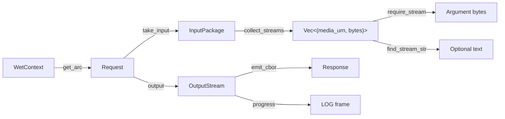

# Handler Patterns

How to implement request handlers: the Op trait, argument extraction, output emission, and common patterns.

## Op Trait Implementation

### Rust

Every handler implements `Op<()>`:

```rust
struct ExtractMetadataOp;

#[async_trait]
impl Op<()> for ExtractMetadataOp {
    async fn perform(&self, _dry: &mut DryContext, wet: &mut WetContext) -> OpResult<()> {
        let req = wet.get_arc::<Request>(WET_KEY_REQUEST)
            .ok_or_else(|| OpError::ExecutionFailed("Missing request".to_string()))?;

        let input = req.take_input()?;
        let streams = input.collect_streams().await
            .map_err(|e| OpError::ExecutionFailed(e.to_string()))?;

        let pdf_data = require_stream(&streams, "media:pdf")
            .map_err(|e| OpError::ExecutionFailed(e.to_string()))?;

        let metadata = extract_metadata(pdf_data)?;
        let result = serde_json::to_vec(&metadata)?;
        req.output().emit_cbor(&ciborium::Value::Bytes(result))
            .map_err(|e| OpError::ExecutionFailed(e.to_string()))?;

        Ok(())
    }

    fn metadata(&self) -> OpMetadata {
        OpMetadata::builder("ExtractMetadata").build()
    }
}
```

Source: pdfcartridge, txtcartridge, ggufcartridge, candlecartridge handlers.

### Swift

```swift
struct ExtractMetadataOp: Op, Sendable {
    typealias Output = Void

    func perform(dry: DryContext, wet: WetContext) async throws {
        let req = try wet.getRequest()
        let input = try req.takeInput()
        let streams = try await input.collectStreams()

        let pdfData = try requireStream(streams, mediaUrn: "media:pdf")
        let metadata = extractMetadata(pdfData)
        let result = try JSONEncoder().encode(metadata)
        try req.output().emit(chunk: result)
    }

    func metadata() -> OpMetadata {
        OpMetadata.builder("ExtractMetadata").build()
    }
}
```

Source: mlxcartridge handlers.

## Argument Extraction



### Collecting Streams

The standard pattern for getting arguments from the input:

```rust
let req = wet.get_arc::<Request>(WET_KEY_REQUEST).unwrap();
let input = req.take_input()?;
let streams = input.collect_streams().await?;
// streams: Vec<(String, Vec<u8>)> — [(media_urn, bytes), ...]
```

`collect_streams()` waits for all input streams to arrive and accumulates each stream's bytes separately. Each tuple is `(media_urn, bytes)` — the media URN identifies which argument it is.

### Looking Up Arguments

After collecting streams, use the lookup helpers to find specific arguments:

```rust
// Required binary argument — fails if missing
let pdf_data = require_stream(&streams, "media:pdf")?;

// Required text argument — fails if missing or not valid UTF-8
let prompt = require_stream_str(&streams, "media:text;encoding=utf8")?;

// Optional binary argument — returns None if missing
let image_data = find_stream(&streams, "media:image;png");

// Optional text argument — returns None if missing
let model_override = find_stream_str(&streams, "media:model-spec;textable");
```

Matching uses `MediaUrn::is_equivalent()` — exact tag-set comparison, not subsumption. The media URN must match the cap's argument definition exactly.

### Parsing Numeric Arguments

Numeric arguments arrive as UTF-8 string representations, not as CBOR numbers. The convention:

```rust
let max_tokens: u32 = find_stream_str(&streams, "media:max-tokens;textable;numeric")
    .and_then(|s| s.parse().ok())
    .unwrap_or(50);  // default if missing or unparseable

let temperature: f32 = find_stream_str(&streams, "media:temperature;textable;numeric")
    .and_then(|s| s.parse().ok())
    .unwrap_or(0.7);
```

This follows the `json_value_to_bytes` convention (see [15.4-PLANNER.md](15.4-PLANNER.md)): strings become raw UTF-8 bytes, numbers are string-encoded.

## Output Emission

### Single Value

For caps that produce a single result (metadata, model info, embeddings):

```rust
let result_bytes = serde_json::to_vec(&response)?;
req.output().emit_cbor(&ciborium::Value::Bytes(result_bytes))?;
```

The runtime sends STREAM_START before the first chunk and STREAM_END + END after the handler returns.

### Streaming List

For caps that produce multiple items (disbind, page extraction):

```rust
for (i, page) in pages.iter().enumerate() {
    req.output().progress(i as f32 / pages.len() as f32, &format!("Page {}", i + 1));
    req.output().emit_list_item(&ciborium::Value::Bytes(page.to_vec()))?;
}
```

Each `emit_list_item()` call produces one item in an RFC 8742 CBOR sequence. The receiver concatenates the raw CBOR bytes.

### Text Output

Text results are encoded as CBOR bytes (UTF-8), not as CBOR text strings:

```rust
req.output().emit_cbor(&ciborium::Value::Bytes(text.into_bytes()))?;
```

This matches the convention that all payload data flows as `Value::Bytes`.

## Progress Emission Patterns

### Standard Milestones (ML Cartridges)

| Progress | Activity |
|----------|----------|
| 0.00 | Starting (before peer call). |
| [0.00, 0.25] | Model download progress (mapped from peer call). |
| 0.25 | Loading model into memory. |
| 0.35 | Model loaded, starting inference. |
| [0.35, 0.95] | Inference progress (per-token or per-step). |
| 0.95 | Complete. |

### Non-ML Milestones (Content Cartridges)

| Progress | Activity |
|----------|----------|
| 0.05 | Starting processing. |
| 0.50 | Midway (e.g., pages processed). |
| 0.90 | Encoding output. |

These are conventions. The protocol does not enforce any particular layout.

## Multi-Type Registration

When the same handler serves multiple media types, register it once per type:

```rust
for media_urn in &["media:text;encoding=utf8", "media:text;rst", "media:text;log", "media:text;markdown"] {
    runtime.register_op(&generate_thumbnail_urn(media_urn), || Box::new(ThumbnailOp));
    runtime.register_op(&extract_metadata_urn(media_urn), || Box::new(MetadataOp));
}
```

The handler uses a fallback lookup to find whichever media URN matches the incoming stream:

```rust
fn require_text_content(streams: &[(String, Vec<u8>)]) -> Result<&[u8], StreamError> {
    for urn in &["media:text;encoding=utf8", "media:text;rst", "media:text;log", "media:text;markdown"] {
        if let Some(bytes) = find_stream(streams, urn) {
            return Ok(bytes);
        }
    }
    Err(StreamError::Protocol("No recognized text stream found".to_string()))
}
```

Cap URN dispatch ensures only the correct media type arrives, so exactly one of the `find_stream` calls will match.

Source: `txtcartridge/src/main.rs`.

## Error Handling in Handlers

- Return `OpError::ExecutionFailed(message)` for handler logic errors.
- Map `RuntimeError` and `StreamError` to `OpError` at the handler boundary.
- Never catch and swallow errors — fail hard to expose problems. A suppressed error becomes a silent data corruption or a hung request.
- The runtime converts handler errors to ERR frames automatically and sends them to the engine.

```rust
// Good: propagate errors
let data = require_stream(&streams, "media:pdf")
    .map_err(|e| OpError::ExecutionFailed(e.to_string()))?;

// Bad: swallow errors (DON'T DO THIS)
// let data = find_stream(&streams, "media:pdf").unwrap_or_default();
```
