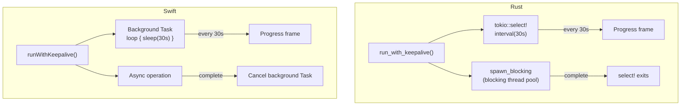

# Rust vs Swift Implementations

Differences between capdag (Rust) and capdag-objc (Swift/Objective-C) and how to write cartridges in each.

## Module Coverage

### Shared Modules (Both Languages)

Both implementations cover the same core functionality:

| Module | Rust location | Swift location |
|--------|---------------|----------------|
| URN types (CapUrn, MediaUrn, CapMatrix) | `capdag/src/urn/` | `capdag-objc/Sources/CapDAG/` |
| Cap definitions and validation | `capdag/src/cap/` | `capdag-objc/Sources/CapDAG/` |
| capdag protocol (Frame, IO) | `capdag/src/bifaci/frame.rs`, `io.rs` | `capdag-objc/Sources/Bifaci/` |
| CartridgeRuntime | `capdag/src/bifaci/cartridge_runtime.rs` | `capdag-objc/Sources/Bifaci/CartridgeRuntime.swift` |
| CartridgeHost | `capdag/src/bifaci/host_runtime.rs` | `capdag-objc/Sources/Bifaci/CartridgeHost.swift` |
| Relay and RelaySwitch | `capdag/src/bifaci/relay.rs`, `relay_switch.rs` | `capdag-objc/Sources/Bifaci/Relay.swift`, `RelaySwitch.swift` |
| Planner (all modules) | `capdag/src/planner/` | `capdag-objc/Sources/Bifaci/Planner/` |
| Orchestrator (parser, types, validation, plan converter) | `capdag/src/orchestrator/` | `capdag-objc/Sources/Bifaci/Orchestrator/` |

### Rust Only

- **Orchestrator executor** (`capdag/src/orchestrator/executor.rs`): Process spawning, Unix socket management, relay lifecycle. This is deeply platform-dependent and not ported.
- **Machine notation parser** (`capdag/src/machine/`): PEG-based machine notation grammar (`machine.pest`). Swift uses a different parsing approach.
- **Input resolver** (`capdag/src/input_resolver/`): File type detection and media adapters.
- **In-process host** (`capdag/src/bifaci/in_process_host.rs`): Testing helper for dispatching to handlers without process spawning.

### Swift Only

- **DOT graph parser** (`capdag-objc/Sources/Bifaci/Orchestrator/DotParser.swift`): Used instead of the PEG machine parser. Parses DOT/Graphviz notation for DAG descriptions.
- **Objective-C foundation layer** (`capdag-objc/Sources/CapDAG/`): `CSCapUrn`, `CSCap`, etc. — C-compatible API for interoperability with Objective-C code and the macOS app shell.

## Language-Specific Patterns

### Async Runtime

| Aspect | Rust | Swift |
|--------|------|-------|
| Runtime | tokio multi-threaded | structured concurrency (async/await) |
| Entry point | `#[tokio::main] async fn main()` | `@main struct`, synchronous `main()` |
| Task spawning | `tokio::spawn(async { ... })` | `Task { ... }` |
| Blocking work | `tokio::task::spawn_blocking(closure)` | Background `Task` + cancellation |
| Channels | `tokio::sync::mpsc` | `AsyncStream`, Foundation channels |

The key architectural difference: Rust's `spawn_blocking` moves work to a dedicated thread pool, explicitly freeing the async workers. Swift's structured concurrency does not have an equivalent separation — blocking work inside a `Task` can stall the cooperative thread pool. This is why the Swift keepalive uses a separate background `Task` rather than a thread pool handoff.

### Error Handling

| Aspect | Rust | Swift |
|--------|------|-------|
| Pattern | `Result<T, E>` with `?` operator | `throws` / `try` / `catch` |
| Error types | `thiserror` derive macros | Enums conforming to `Error` + `LocalizedError` |
| Interop | — | `NSError` for Objective-C boundaries |

Both implementations define matching error variants (e.g., `RuntimeError::NoHandler` ↔ `CartridgeRuntimeError.noHandler`). The error semantics are identical — the same conditions produce the same errors.

### Op Registration

**Rust**: Factory closure returning a trait object:
```rust
runtime.register_op("cap:...", || Box::new(MyOp::default()));
// or
runtime.register_op_type::<MyOp>("cap:...");
```

**Swift**: Closure returning an `Op` conformer:
```swift
runtime.register_op_type(capUrn: "cap:...", make: MyOp.init)
```

### Cap URN Sourcing

**Rust**: Cap URNs can be extracted from the manifest at runtime via iterator lookup, or constructed with `CapUrnBuilder`, or obtained from standard helpers like `generate_thumbnail_urn()`.

**Swift**: Cap URNs are typically hardcoded string constants. This is less dynamic but simpler for cartridges with a fixed cap set.

### Concurrency Primitives

| Concept | Rust | Swift |
|---------|------|-------|
| Thread-safe sharing | `Arc<T>` + `Send + Sync` traits | `Sendable` protocol, `@unchecked Sendable` |
| Mutability | `Arc<Mutex<T>>`, `AtomicBool` | `NSLock`, actors, `OSAllocatedUnfairLock` |
| Async channels | `tokio::sync::mpsc`, `tokio::sync::oneshot` | `AsyncStream`, Foundation channels |
| Worker threads | `tokio::task::spawn_blocking` | No direct equivalent (use `Task` or GCD) |

## Keepalive Differences



Both implementations emit keepalive frames every 30 seconds during blocking operations. The mechanism differs:

**Rust** (`run_with_keepalive`):
1. Closure runs on `tokio::task::spawn_blocking` (dedicated blocking thread pool).
2. `tokio::select!` with `tokio::time::interval(30s)` emits keepalive frames.
3. When `spawn_blocking` completes, the select loop exits.

**Swift** (`runWithKeepalive`):
1. Background `Task` emits progress frames in a loop with `Task.sleep(30s)`.
2. Main async operation runs concurrently.
3. When the main operation completes, the background `Task` is cancelled.

The Rust approach explicitly frees tokio workers (critical because the writer task needs them). The Swift approach relies on structured concurrency's cooperative scheduling.

## Manifest Encoding

**Rust**: `CapManifest` struct serialized to JSON via `serde_json::to_vec()`. Passed to `CartridgeRuntime::new()` or `CartridgeRuntime::with_manifest()`.

**Swift**: `Manifest` struct encoded via `JSONEncoder().encode()` to `Data`. Passed to `CartridgeRuntime(manifest:)`.

The JSON format is identical on the wire — the host sees no difference between a Rust and Swift cartridge's manifest.

## Testing

**Rust**: Tests run via `cargo test`. The `in_process_host.rs` module provides `InProcessCartridgeHost` and `FrameHandler` for testing handlers without process spawning. Integration tests in `integration_tests.rs` test the full frame protocol.

**Swift**: Tests run via Xcode test targets. The capdag-objc package includes test targets for URN types, planner modules, and protocol handling.

Both implementations share test IDs (e.g., TEST148, TEST684) for traceability across languages. A test with the same ID in both implementations validates the same behavior.
