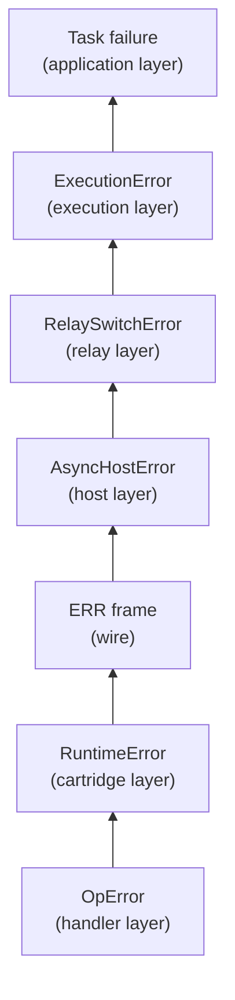
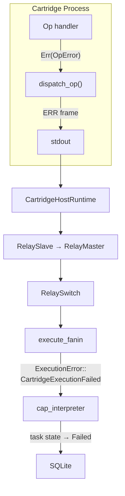
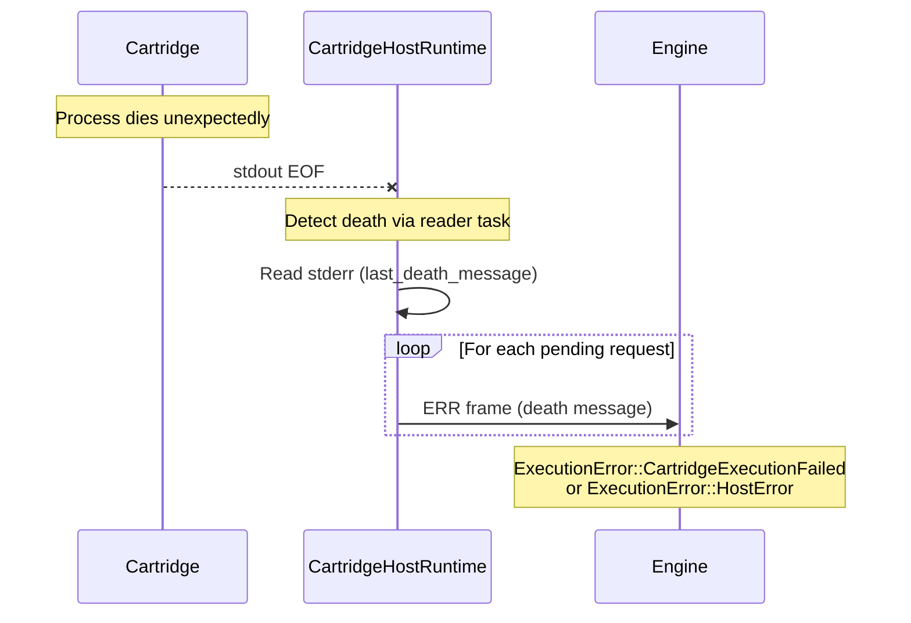

# Error Handling

Error types across the stack, error propagation patterns, and common failure modes.

## Error Type Hierarchy

Each layer of the system defines its own error type. Errors propagate upward — a cartridge handler error becomes a runtime error, then an ERR frame, then an execution error, then a task failure.

### Cartridge Layer (RuntimeError)

Defined in `capdag/src/bifaci/cartridge_runtime.rs`:

| Variant | Cause |
|---------|-------|
| `Cbor` | CBOR encoding or decoding failure. |
| `Io` | I/O error on stdin/stdout. |
| `NoHandler` | REQ arrived for a cap URN with no registered handler. |
| `Handler` | Handler logic error (custom message from the Op). |
| `CapUrn` | Cap URN parse error. |
| `Deserialize` / `Serialize` | Data conversion errors. |
| `PeerRequest` | Peer call initiation failed. |
| `PeerResponse` | Peer call response error. |
| `Cli` | CLI argument parsing error. |
| `MissingArgument` | Required argument not provided. |
| `UnknownSubcommand` | CLI subcommand not recognized. |
| `Manifest` | Manifest validation error. |
| `CorruptedData` | Data integrity check failed. |
| `Protocol` | Protocol violation (unexpected frame type, missing required fields). |
| `Stream` | Stream-level error (wraps `StreamError`). |

### Host Layer (AsyncHostError)

Defined in `capdag/src/bifaci/host_runtime.rs`:

| Variant | Cause |
|---------|-------|
| `Cbor` | CBOR error during frame processing. |
| `Io` | I/O error on cartridge pipes or relay socket. |
| `CartridgeError` | Cartridge sent an ERR frame (code + message). |
| `ProcessExited` | Cartridge process died unexpectedly. |
| `Handshake` | HELLO negotiation failed. |
| `Closed` | Host has been shut down. |
| `DuplicateStreamId` | Stream ID reused within a request. |
| `UnknownStreamId` | CHUNK for a stream that was never opened. |
| `ChunkAfterStreamEnd` | CHUNK after the stream was ended. |
| `StreamAfterRequestEnd` | Stream activity after END frame. |
| `StreamStartMissingId` / `StreamStartMissingUrn` | Required fields missing on STREAM_START. |
| `ChunkMissingStreamId` | CHUNK without a stream_id. |
| `Protocol` | Other protocol violations. |
| `NoHandler` | No cartridge handles the requested cap. |

### Relay Layer (RelaySwitchError)

Defined in `capdag/src/bifaci/relay_switch.rs`:

| Variant | Cause |
|---------|-------|
| `Cbor` | CBOR error during frame processing. |
| `Io` | I/O error on master socket. |
| `NoHandler` | No master provides the requested cap. |
| `UnknownRequest` | (XID, RID) not in routing tables (continuation frame for unknown request). |
| `Protocol` | Protocol violation. |
| `AllMastersUnhealthy` | No healthy masters available for routing. |

### Execution Layer (ExecutionError)

Defined in `capdag/src/orchestrator/executor.rs`:

| Variant | Cause |
|---------|-------|
| `CartridgeNotFound` | No cartridge binary provides the required cap. |
| `ActivityTimeout` | No frames received for > timeout seconds (default 120s). |
| `CartridgeExecutionFailed` | Cartridge returned ERR frame (code + message). |
| `NoIncomingData` | Source node data missing when executing an edge group. |
| `IoError` | Infrastructure I/O failure. |
| `HostError` | CartridgeHostRuntime error. |
| `RegistryError` | Cartridge registry lookup or download failure. |

### Handler Layer (OpError)

Defined in the `ops` crate:

| Variant | Cause |
|---------|-------|
| `ExecutionFailed` | Generic handler failure with a message string. |

All handler errors are wrapped in this type. The message should be descriptive enough for debugging.

## Error Propagation

### Cartridge → Engine

When a handler fails, the error travels through several layers:

1. **Handler** returns `Err(OpError::ExecutionFailed("message"))`.
2. **CartridgeRuntime** catches the error in `dispatch_op()`.
3. **ERR frame** sent to stdout with the error code and message.
4. **CartridgeHostRuntime** forwards the ERR frame to the relay.
5. **RelaySlave → RelayMaster → RelaySwitch** routes the ERR frame to the engine.
6. **execute_fanin** receives the ERR frame on the response channel.
7. Returns `ExecutionError::CartridgeExecutionFailed { cap_urn, code, message }`.
8. **cap_interpreter** records the failure; task state → `Failed`.

### Cartridge Death

When a cartridge process dies unexpectedly:

1. **CartridgeHostRuntime** detects stdout EOF (reader task returns).
2. Reads stderr for crash output (last_death_message).
3. For each pending request: sends an ERR frame to the relay with the death message.
4. **execute_fanin** receives the ERR frame or channel closure.
5. Returns `ExecutionError::CartridgeExecutionFailed` or `ExecutionError::HostError`.

### Activity Timeout

When no frames arrive for too long:

1. **execute_fanin** monitors `last_activity` timestamp in its select loop.
2. If `Instant::now() - last_activity > timeout` (default 120s):
3. Returns `ExecutionError::ActivityTimeout { cap_urn, seconds }`.
4. Task is marked as failed.

The timeout is checked on every iteration of the select loop (every 200ms due to the pump timeout).

## Common Failure Modes

### Stderr Blocking

**Symptom**: Cartridge at 0% CPU, all threads sleeping, task appears idle, eventually times out.

**Cause**: An FFI library's log callback calls `fputs(text, stderr)`. In a GUI app sandbox, stderr goes to `/dev/null`. On macOS, `write()` to a dead file descriptor can block forever in `__write_nocancel`.

**Fix**: Suppress log callbacks before loading models:
- `backend.void_logs()` for llama.cpp.
- `mtmd_log_set(void_callback)` for CLIP/MTMD.
- Remove any `fputs(stderr)` or `eprintln!()` calls in cartridge code.

Source: ggufcartridge `vision.rs`, `model.rs`. See [13.4-PROGRESS-AND-LOGGING.md](13.4-PROGRESS-AND-LOGGING.md).

### Writer Task Starvation

**Symptom**: Frames queued in the output channel but never reach the engine. Activity timeout fires after 120s.

**Cause**: Blocking FFI (model load) runs on a tokio worker thread. The writer task needs a tokio worker to drain the output channel and write to stdout. If all workers are blocked, frames never flush.

**Fix**: Use `run_with_keepalive()` to move blocking work to `tokio::task::spawn_blocking`. This frees the tokio workers for the writer task and emits keepalive frames every 30s.

Source: `cartridge_runtime.rs`. See [13.4-PROGRESS-AND-LOGGING.md](13.4-PROGRESS-AND-LOGGING.md).

### Missing Peer Route

**Symptom**: `RelaySwitchError::NoHandler` when a cartridge makes a peer call.

**Cause**: A cartridge calls a cap that no registered cartridge provides. This happens when the executor only registered DAG-referenced caps instead of all manifest caps.

**Fix**: The executor registers ALL manifest caps from each cartridge, not just the ones referenced by the DAG. This ensures peer invocations can route to caps that are not in the DAG but are in another cartridge's manifest.

Source: `executor.rs`, `relay_switch.rs`.

### Disk Full During Download

**Symptom**: Peer response contains error "No space left on device (os error 28)".

**Cause**: Model download fails because the disk does not have enough space for the model file.

**Fix**: Free disk space. The model cartridge does not pre-check available space — it fails during the write.

## Fail-Fast Philosophy

The project follows a strict fail-fast approach:

- **No stopgaps**: No placeholder values that paper over missing data.
- **No fallbacks that hide issues**: If a required stream is missing, fail — do not substitute an empty buffer.
- **No error swallowing**: Every `Result` is propagated with `?` or handled explicitly. `let _ = ...` is only used for non-critical side effects (progress emission, where failure to emit is not worth crashing over).
- **Panics for invariant violations**: `Frame::req()` panics on invalid cap URNs. `CartridgeRuntime::new()` panics on missing CAP_IDENTITY. These are bugs in the calling code, not runtime errors.
- **Descriptive errors**: Every error variant includes enough context (cap URN, node name, frame type) to diagnose the problem without a debugger.

This philosophy means bugs surface as loud failures at the point of the error rather than as mysterious behavior downstream.
