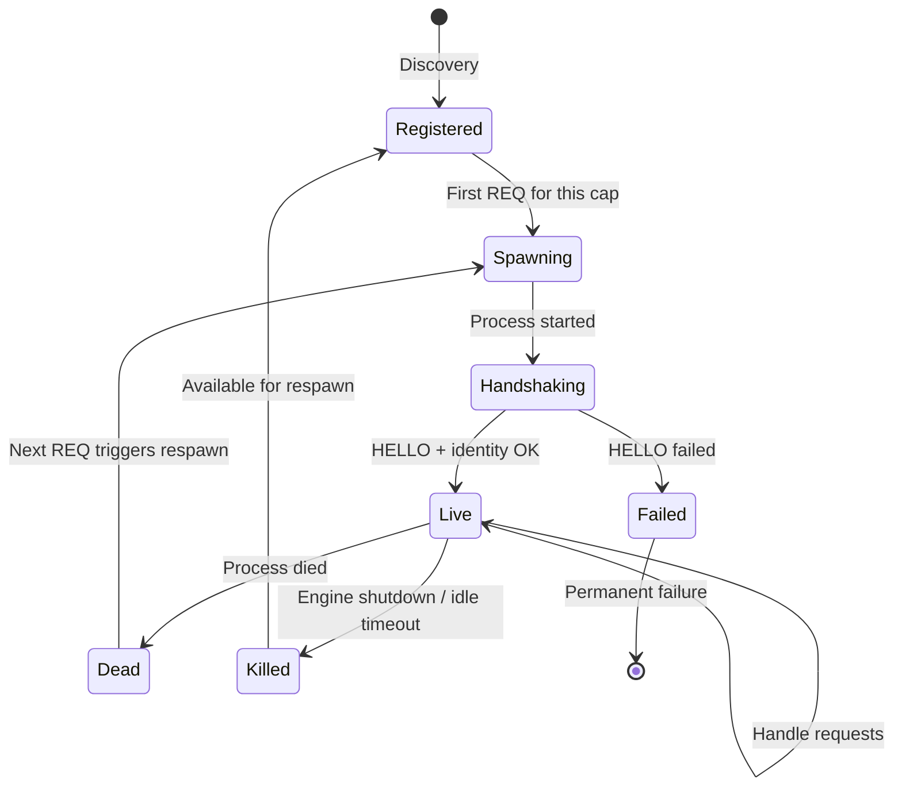

# Cartridge Anatomy

The structure of a cartridge plugin: entry point, manifest, cap definitions, and handler registration.

## What Is a Cartridge

A cartridge is a standalone binary that communicates with the engine via the Bifaci protocol over stdin/stdout. Each cartridge provides one or more capabilities (caps). The engine discovers cartridges, spawns them on demand when their caps are needed, and manages their lifecycle through the PluginHostRuntime.

Existing cartridges:

| Name | Language | Framework | Caps |
|------|----------|-----------|------|
| ggufcartridge | Rust | llama.cpp | LLM text generation, vision, embeddings, vocab, model info |
| candlecartridge | Rust | Candle | BERT embeddings, CLIP, BLIP, Whisper |
| mlxcartridge | Swift | MLX | LLM text generation, vision, embeddings |
| pdfcartridge | Rust | — | Thumbnail, metadata, outline, disbind |
| txtcartridge | Rust | — | Thumbnail, metadata, outline for text files |
| modelcartridge | Rust | — | Model downloading and caching |

## Entry Point

### Rust

```rust
#[tokio::main]
async fn main() -> Result<(), Box<dyn std::error::Error>> {
    let manifest = build_manifest();
    let mut runtime = PluginRuntime::with_manifest(manifest);

    runtime.register_op("cap:in=...;out=...;op=generate", || Box::new(GenerateOp));
    runtime.register_op("cap:in=...;out=...;op=extract;target=metadata", || Box::new(MetadataOp));

    runtime.run().await?;
    Ok(())
}
```

The `#[tokio::main]` attribute sets up the multi-threaded async runtime. `run()` detects whether the binary was launched with CLI arguments (CLI mode) or without (Bifaci plugin mode) and handles both.

Source: `ggufcartridge/src/main.rs`, `candlecartridge/src/main.rs`, `pdfcartridge/src/main.rs`, `txtcartridge/src/main.rs`.

### Swift

```swift
@main
struct MLXCartridge {
    static func main() {
        let manifest = buildManifest()
        let manifestData = try! JSONEncoder().encode(manifest)
        let runtime = PluginRuntime(manifest: manifestData)

        runtime.register_op_type(capUrn: CAP_GENERATE, make: GenerateTextOp.init)
        runtime.register_op_type(capUrn: CAP_DESCRIBE, make: DescribeImageOp.init)

        try! runtime.run()
    }
}
```

Swift cartridges use `@main` for the entry point. `run()` blocks until stdin closes.

Source: `mlxcartridge/Sources/mlxcartridge/main.swift`.

## Manifest

The manifest tells the engine what this cartridge can do. It is a `CapManifest` struct serialized to JSON and sent during the HELLO handshake:

```rust
let manifest = CapManifest::new(
    "pdfcartridge".to_string(),
    "1.0.0".to_string(),
    "PDF document processing".to_string(),
    vec![
        identity_cap(),        // Required: identity verification
        thumbnail_cap,
        metadata_cap,
        outline_cap,
        disbind_cap,
    ],
);
```

Fields:
- **name**: Cartridge name.
- **version**: Semver version string.
- **description**: What this cartridge does.
- **caps**: List of `Cap` definitions (see below).
- **author** (optional): Maintainer name.
- **page_url** (optional): Documentation or repository URL.

Source: `capdag/src/bifaci/manifest.rs`, `capdag/src/cap/definition.rs`.

### Identity Cap

Every manifest must include the identity cap — `identity_cap()` in Rust or the equivalent in Swift. This cap handles the identity verification step during handshake (see [22-HANDSHAKE.md](22-HANDSHAKE.md)). `PluginRuntime::new()` panics if CAP_IDENTITY is missing from the manifest.

The identity handler is registered automatically by the runtime. You only need to include `identity_cap()` in the manifest's cap list.

Source: `capdag/src/standard/caps.rs`.

## Cap Definition

A `Cap` defines a single capability:

```rust
let cap = Cap::new(
    CapUrn::from_string("cap:in=\"media:pdf\";out=\"media:record\";op=extract;target=metadata").unwrap(),
    "Extract Metadata".to_string(),
    "extract-metadata".to_string(),  // slug (CLI subcommand name)
);
```

Fields:
- **urn**: The `CapUrn` identifying this capability. Defines the input/output media types and operation tags.
- **title**: Human-readable name for display.
- **slug**: Short name used as the CLI subcommand.
- **args**: List of `CapArg` definitions (input arguments).
- **metadata**: Optional key-value pairs (e.g., `activity_timeout_secs` for custom timeouts).

Source: `capdag/src/cap/definition.rs`.

### CapArg

Each argument a cap accepts is described by a `CapArg`:

```rust
let arg = CapArg::new(
    "media:pdf",          // media URN identifying this argument
    true,                 // required
    vec![ArgSource::Stdin { stdin: "media:pdf".to_string() }],
);
```

Fields:
- **media_urn**: The media URN that identifies this argument in the stream. The handler uses this to find the argument via `find_stream()` or `require_stream()`.
- **required**: Whether the argument must be provided.
- **sources**: How the argument can be provided (for CLI mode).
- **default_value** (optional): Default value as `serde_json::Value`.
- **description** (optional): Human-readable description.

### Argument Sources

`ArgSource` describes how an argument can be provided in CLI mode:

| Variant | Description | Example |
|---------|-------------|---------|
| `Stdin { stdin }` | Primary input stream. The stdin media URN identifies the data type. | A PDF file piped via stdin. |
| `Position { position }` | Positional CLI argument (0-based index). | `mycart extract doc.pdf` (position 0 = file path). |
| `CliFlag { cli_flag }` | Named CLI flag. | `mycart generate --model gpt2`. |

Source: `capdag/src/cap/definition.rs`.

## Cap URN Construction

### Builder Pattern (Rust)

`CapUrnBuilder` constructs cap URNs programmatically:

```rust
use capdag::CapUrnBuilder;

let urn = CapUrnBuilder::new()
    .in_urn("media:pdf")
    .out_urn("media:record")
    .tag("op", "extract")
    .tag("target", "metadata")
    .build()?;
```

### Standard Helpers

For common operations, standard helpers in `capdag::standard::caps` generate the appropriate cap URN:

```rust
use capdag::standard::caps::*;

let thumb_urn = generate_thumbnail_urn("media:pdf");   // thumbnail generation
let meta_urn  = extract_metadata_urn("media:pdf");     // metadata extraction
let outline_urn = extract_outline_urn("media:pdf");    // outline extraction
let disbind_urn = disbind_urn("media:pdf");            // page extraction
```

Each helper takes a media URN and returns the canonical cap URN string for that operation on that media type.

### Hardcoded Constants (Swift)

Swift cartridges typically use hardcoded string constants for cap URNs rather than builder patterns. This is a pragmatic choice — the builder API is less ergonomic in Swift.

## Handler Registration

Each cap in the manifest must have a corresponding handler registered with `PluginRuntime`. The cap URN string used for registration must match what dispatch will resolve — it must be `is_dispatchable` against incoming requests for the caps declared in the manifest.

```rust
// Factory function — creates new handler per request
runtime.register_op("cap:in=...;out=...;op=generate", || Box::new(GenerateOp));

// Default type — creates via Default::default()
runtime.register_op_type::<MetadataOp>("cap:in=...;out=...;op=extract;target=metadata");
```

Registering a handler for a cap URN that is not in the manifest is harmless but useless — no request will arrive for it. Failing to register a handler for a cap in the manifest means requests for that cap will get a `NoHandler` error.

## Cartridge Lifecycle



1. **Discovery**: The engine's plugin registry or dev_plugins mapping identifies which cartridge binary provides a given cap.
2. **First request**: When a REQ arrives for a cap this cartridge provides, the PluginHostRuntime spawns the binary with no arguments (triggering plugin CBOR mode).
3. **Handshake**: HELLO exchange and identity verification (see [22-HANDSHAKE.md](22-HANDSHAKE.md)).
4. **Request handling**: The engine sends REQ frames; the cartridge dispatches them to registered handlers.
5. **Idle or shutdown**: The cartridge may be killed after an idle timeout or when the engine shuts down.
6. **Respawn**: The next request for this cartridge's caps triggers a fresh spawn. Model caches are on disk, so reloading is the only cost.

Source: `host_runtime.rs`, `executor.rs`.
