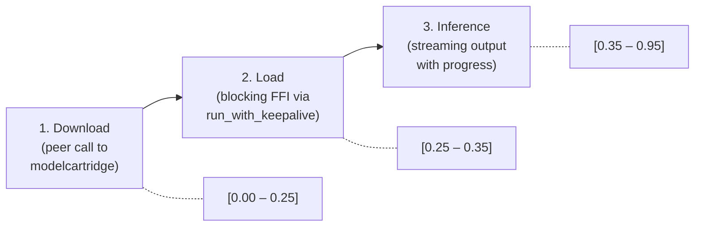

# Model Cartridges

ML model cartridges: model downloading via peer calls, model loading with keepalive, inference with streaming progress.

## Model Cartridge Architecture

All ML cartridges share a three-phase architecture:



1. **Download**: Delegate to `modelcartridge` via a peer call. The model cartridge handles HTTP downloads, local caching, and hash verification. Returns a local file path.
2. **Load**: Load the model into memory via blocking FFI (llama.cpp, Candle, MLX). Uses `run_with_keepalive` to prevent activity timeouts.
3. **Inference**: Run the model on the input data. Emit per-token or per-step progress.

Source: ggufcartridge, candlecartridge, mlxcartridge handlers.

## Existing Model Cartridges

### ggufcartridge (Rust, llama.cpp)

Provides GGUF-format model inference via the llama.cpp FFI:

- **Text generation**: Streaming and constrained (grammar-based) generation.
- **Vision**: Image description via CLIP/MTMD multimodal models.
- **Embeddings**: Text embeddings and embedding dimensions.
- **Vocabulary**: Token vocabulary extraction.
- **Model info**: Model metadata (parameter count, context size, architecture).

Uses `GgufModelManager` for model lifecycle management and `LlamaBackend` for the llama.cpp FFI layer.

Source: `ggufcartridge/src/main.rs`, `model.rs`, `vision.rs`.

### candlecartridge (Rust, Candle)

Provides inference via Hugging Face's Candle framework:

- **Text embeddings**: BERT sentence embeddings.
- **Embedding dimensions**: For BERT, CLIP models.
- **Image embeddings**: CLIP image embeddings.
- **Image description**: BLIP image captioning.
- **Speech transcription**: Whisper audio-to-text.

Source: `candlecartridge/src/main.rs`.

### mlxcartridge (Swift, MLX)

Provides inference via Apple's MLX framework on Apple Silicon:

- **Text generation**: LLM text generation.
- **Vision**: Image description via multimodal models.
- **Text embeddings**: Sentence embeddings.
- **Embedding dimensions**.

Source: `mlxcartridge/Sources/mlxcartridge/main.swift`.

## Model Download via Peer Call

All three cartridges use the same pattern for downloading models. The handler calls `modelcartridge` via the peer invoker:

```rust
let model_spec_json = serde_json::json!({
    "repo_id": "TheBloke/Llama-2-7B-GGUF",
    "filename": "llama-2-7b.Q4_K_M.gguf"
});
let spec_bytes = serde_json::to_vec(&model_spec_json)?;

let response = req.peer().call_with_bytes(
    "cap:in=\"media:model-spec;textable\";out=\"media:file-path;textable\";op=download-model",
    &[("media:model-spec;textable", &spec_bytes)],
).await?;
```

The response contains:
- `PeerResponseItem::Log` frames with download progress (file counts, byte counts).
- `PeerResponseItem::Data` with a JSON result containing the local model path.

Source: ggufcartridge `model.rs` (`resolve_model_path`), candlecartridge (`ensure_model_available`), mlxcartridge (`ensureModelAvailable`).

### Progress Forwarding

The handler forwards the peer's download progress to its own progress stream, mapped to the [0.0, 0.25] range:

```rust
let mut model_path = String::new();
let response = call.finish().await?;

while let Some(item) = response.recv().await {
    match item {
        PeerResponseItem::Data(Ok(value)) => {
            // Extract model path from response
            model_path = extract_path(&value)?;
        }
        PeerResponseItem::Log(frame) => {
            if let Some(peer_progress) = frame.log_progress() {
                let mapped = peer_progress * 0.25; // [0.0, 0.25] range
                req.output().progress(mapped, frame.log_message().unwrap_or("Downloading"));
            }
        }
        PeerResponseItem::Data(Err(e)) => return Err(e.into()),
    }
}
```

See [33-PROGRESS-AND-LOGGING.md](33-PROGRESS-AND-LOGGING.md) for the general progress forwarding pattern.

## Model Loading with Keepalive

### Why Keepalive Is Needed

Loading a large model via FFI (e.g., `llama_model_load()` for a 7B parameter GGUF) can take 30–120 seconds. This is a synchronous, blocking call that ties up the thread it runs on.

If this call runs on a tokio worker thread, the frame writer task (which also needs a tokio worker) cannot flush frames to stdout. The engine sees no frames and, after 120 seconds, triggers its activity timeout.

`run_with_keepalive` moves the blocking call to `tokio::task::spawn_blocking` (a separate thread pool) and emits progress frames every 30 seconds on the freed-up async runtime. See [33-PROGRESS-AND-LOGGING.md](33-PROGRESS-AND-LOGGING.md) for the mechanism.

### Rust Pattern

```rust
req.output().progress(0.25, "Loading model...");
let model = req.output().run_with_keepalive(0.25, "Loading model...", move || {
    LlamaModel::load_from_file(&model_path, &params)
}).await;
let model = model.map_err(|e| OpError::ExecutionFailed(format!("Model load failed: {}", e)))?;
req.output().progress(0.35, "Model loaded");
```

Source: ggufcartridge, candlecartridge handlers.

### Swift Pattern

```swift
output.progress(0.25, message: "Loading model...")
let container = try await output.runWithKeepalive(progress: 0.25, message: "Loading model...") {
    try await ModelFactory.shared.loadContainer(configuration: config)
}
output.progress(0.35, message: "Model loaded")
```

Source: mlxcartridge handlers.

### Vision Pipeline Special Case

The ggufcartridge's vision pipeline (`handle_describe_image`) has a special constraint: `VisionEngine<'a>` borrows from `&GgufModelManager` and `&LoadedModel`, so it has lifetime parameters and cannot be returned from `spawn_blocking`.

The solution: run the entire vision pipeline — text model load, mmproj model load, and inference — in a single `spawn_blocking` closure. A `ProgressSender` is passed into the closure for per-token progress:

```rust
let ps = req.output().progress_sender();
let result = tokio::task::spawn_blocking(move || {
    ps.progress(0.25, "Loading text model...");
    let text_model = load_text_model(&path)?;

    ps.progress(0.30, "Loading vision model...");
    let vision = VisionEngine::new(&manager, &text_model, &mmproj_path)?;

    ps.progress(0.35, "Running inference...");
    vision.describe(&image, |token_idx, total| {
        let p = 0.35 + 0.6 * (token_idx as f32 / total as f32);
        ps.progress(p, "Generating description...");
    })
}).await??;
```

Source: `ggufcartridge/src/main.rs` (`handle_describe_image`), `vision.rs`.

## FFI Log Callback Suppression

FFI libraries often have internal logging that writes to stderr. In a GUI app sandbox, stderr is not drained, and `fputs(text, stderr)` blocks forever. This was the root cause of the `clip_log_callback_default` deadlock.

Two separate suppression mechanisms are needed because llama.cpp and CLIP/MTMD have independent log callback globals:

**llama.cpp logs**:
```rust
backend.void_logs(); // Calls llama_log_set() with a no-op callback
```

**CLIP/MTMD logs** (separate global):
```rust
unsafe {
    unsafe extern "C" fn void_log(
        _level: ggml_log_level,
        _text: *const c_char,
        _user_data: *mut c_void,
    ) {}
    mtmd_log_set(Some(void_log), std::ptr::null_mut());
}
```

Both must be called before loading models. Forgetting to suppress CLIP logs is what caused the deadlock — `backend.void_logs()` only suppresses llama logs, not CLIP logs.

Source: `ggufcartridge/src/model.rs`, `vision.rs`.

## Inference with Streaming Progress

During inference, handlers emit per-token progress mapped to the [0.35, 0.95] range:

```rust
let progress_base = 0.35;
let progress_range = 0.60; // 0.35 to 0.95
let mut last_reported = 0;

for (i, token) in tokens.iter().enumerate() {
    let pct = (i * 100) / max_tokens;
    if pct >= last_reported + 5 { // throttle at 5% boundaries
        let p = progress_base + progress_range * (i as f32 / max_tokens as f32);
        req.output().progress(p, "Generating...");
        last_reported = pct;
    }
    // ... emit token ...
}
req.output().progress(0.95, "Complete");
```

Throttling at 5% boundaries avoids flooding the engine with progress frames. At 200 tokens, this produces ~20 progress frames rather than 200.

When inference runs inside `spawn_blocking`, use a `ProgressSender` instead of `output.progress()`.

## Model Spec Arguments

Model specification arguments follow a standard convention: the media URN `media:model-spec;textable` (with optional framework qualifier like `gguf`, `candle`, `mlx`) carries a HuggingFace repo ID or local path as UTF-8 text.

Default values are set in the cap definition's argument defaults. For example, a GGUF text generation cap might default to `"TheBloke/Llama-2-7B-GGUF"`. Users can override this via slot values in the plan.
