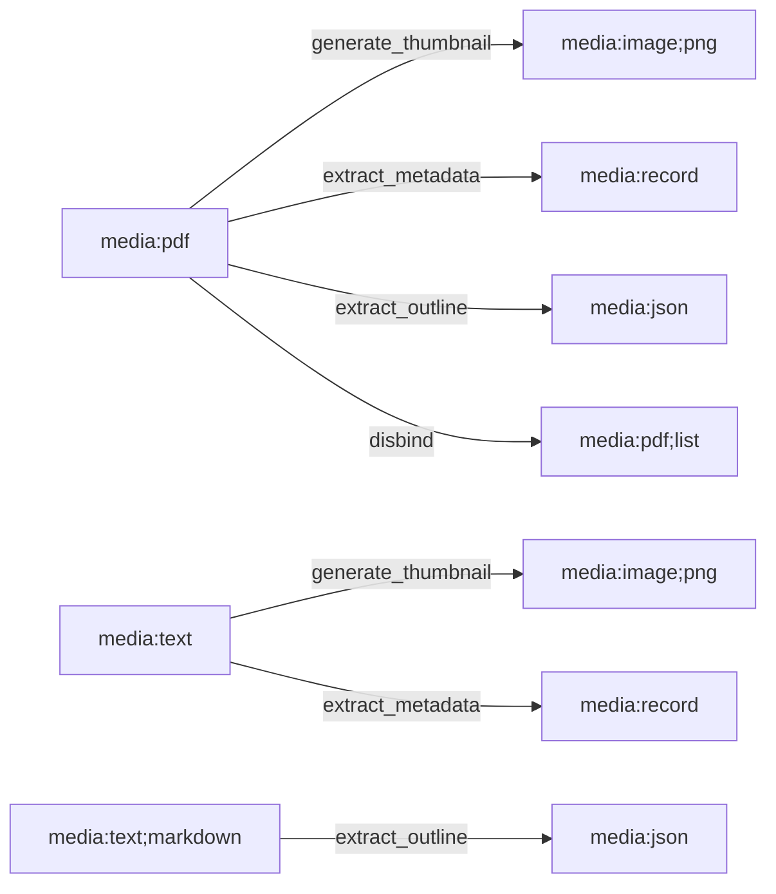

# Content Cartridges

Document processing cartridges: PDF, text, and the standard cap patterns they use.

## Content Cartridge Architecture

Content cartridges are simpler than model cartridges:

- No peer calls — all processing is self-contained.
- No model loading or keepalive — operations complete quickly.
- Shorter handler implementations — typically under 100 lines each.
- Use standard cap URN helpers from `capdag::standard::caps`.

The handler pattern is: receive input → process → emit output. No three-phase architecture, no FFI thread management.

Source: pdfcartridge, txtcartridge.

## Standard Caps



`capdag::standard::caps` defines cap URN helpers for common document operations:

| Function | Operation | Description |
|----------|-----------|-------------|
| `generate_thumbnail_urn(media)` | `op=generate;target=thumbnail` | Render a visual preview of the input. |
| `extract_metadata_urn(media)` | `op=extract;target=metadata` | Extract structured metadata (title, author, page count, dates). |
| `extract_outline_urn(media)` | `op=extract;target=outline` | Extract document outline or table of contents. |
| `disbind_urn(media)` | `op=disbind` | Extract individual pages or sections as separate items. |

Each function takes a media URN (e.g., `"media:pdf"`) and returns the cap URN string for that operation on that media type. The cap URN includes the appropriate `in=` and `out=` specs.

Source: `capdag/src/standard/caps.rs`.

## pdfcartridge

Provides four caps for PDF documents:

### generate_thumbnail

Renders PDF pages as PNG thumbnails. Arguments:

- `media:pdf` (required, stdin): The PDF document.
- `media:width;textable;numeric` (optional): Output width in pixels.
- `media:height;textable;numeric` (optional): Output height in pixels.
- `media:index-range;textable` (optional): Which pages to render (e.g., "0-2" for first three pages).

### extract_metadata

Extracts PDF metadata as JSON. Returns a record with title, author, subject, creator, creation date, modification date, page count, and other document properties.

Arguments: `media:pdf` (required, stdin).

### extract_outline

Extracts the PDF outline (bookmarks/table of contents) as a hierarchical JSON structure. Arguments:

- `media:pdf` (required, stdin).
- `media:max-depth;textable;numeric` (optional): Maximum depth of outline traversal.
- `media:include-order-indexes;textable` (optional): Whether to include ordering indexes.

### disbind

Extracts individual PDF pages as separate items. Uses `emit_list_item()` to stream pages one at a time:

```rust
for (i, page_bytes) in pages.iter().enumerate() {
    output.progress(i as f32 / pages.len() as f32, &format!("Page {}", i + 1));
    output.emit_list_item(&ciborium::Value::Bytes(page_bytes.to_vec()))?;
}
```

Source: `pdfcartridge/src/main.rs`.

## txtcartridge

Provides thumbnail, metadata, and outline extraction for text-based formats: plain text (`.txt`), reStructuredText (`.rst`), log files (`.log`), and Markdown (`.md`).

The same handler implementations are registered for all four media types. Outline extraction is available only for structured text formats (Markdown, reStructuredText) where headings define the document structure.

### Multi-Type Handler Pattern

A single handler serves multiple media types by trying each known URN:

```rust
fn require_text_content(streams: &[(String, Vec<u8>)]) -> Result<&[u8], StreamError> {
    for urn in &[MEDIA_TXT, MEDIA_RST, MEDIA_LOG, MEDIA_MD] {
        if let Some(bytes) = find_stream(streams, urn) {
            return Ok(bytes);
        }
    }
    Err(StreamError::Protocol("No recognized text stream found".to_string()))
}
```

Registration loops over all media types:

```rust
for media in &[MEDIA_TXT, MEDIA_RST, MEDIA_LOG, MEDIA_MD] {
    runtime.register_op(&generate_thumbnail_urn(media), || Box::new(ThumbnailOp));
    runtime.register_op(&extract_metadata_urn(media), || Box::new(MetadataOp));
}

// Outline only for structured formats
for media in &[MEDIA_MD, MEDIA_RST] {
    runtime.register_op(&extract_outline_urn(media), || Box::new(OutlineOp));
}
```

Cap URN dispatch (see [../05-DISPATCH.md](../05-DISPATCH.md)) ensures that the incoming request matches exactly one of the registered media types. The handler's fallback loop over URNs finds the matching stream.

Source: `txtcartridge/src/main.rs`.

## Building a Content Cartridge

To add a new content cartridge for a hypothetical media type (e.g., EPUB):

1. **Create the crate**: Set up a Rust binary crate with `#[tokio::main]` and dependencies on `capdag` and `ops`.

2. **Define cap URNs**: Use standard helpers or build custom ones:
   ```rust
   let thumb_cap = make_cap(generate_thumbnail_urn("media:epub"));
   let meta_cap = make_cap(extract_metadata_urn("media:epub"));
   ```

3. **Build the manifest**: Include `identity_cap()` and all your caps:
   ```rust
   let manifest = CapManifest::new(
       "epubcartridge".to_string(),
       "1.0.0".to_string(),
       "EPUB document processing".to_string(),
       vec![identity_cap(), thumb_cap, meta_cap],
   );
   ```

4. **Implement handlers**: Each handler implements `Op<()>`. See [51-HANDLER-PATTERNS.md](51-HANDLER-PATTERNS.md) for the standard patterns.

5. **Register and run**:
   ```rust
   let mut runtime = PluginRuntime::with_manifest(manifest);
   runtime.register_op(&generate_thumbnail_urn("media:epub"), || Box::new(ThumbnailOp));
   runtime.register_op(&extract_metadata_urn("media:epub"), || Box::new(MetadataOp));
   runtime.run().await?;
   ```

Use pdfcartridge as a reference implementation — it demonstrates all four standard operations with clean handler code.
