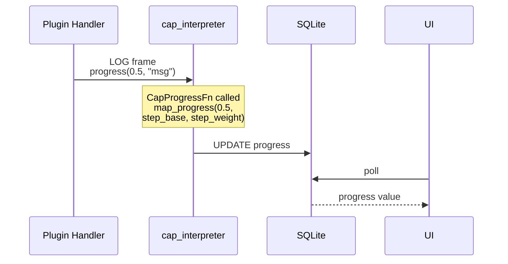
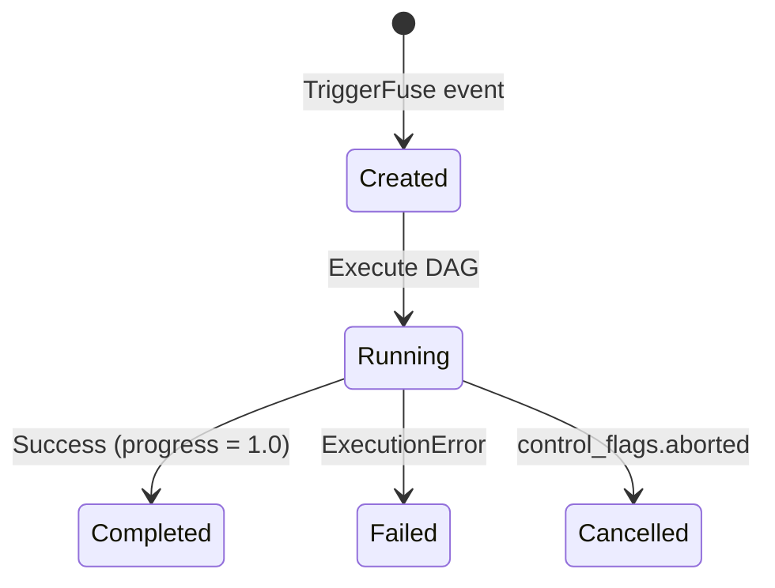

# Task Integration

How cartridge execution ties into machfab tasks: triggers, cap interpretation, progress tracking, and result handling.

## Task System Overview

In MachineFabric, a **task** represents a user-initiated transformation — "describe this image," "extract metadata from these PDFs," "generate thumbnails for this folder." The task system wraps machine execution: it resolves input files, builds or receives an execution plan, runs the DAG through the Bifaci infrastructure, tracks progress, and stores results.

Tasks live in a SQLite database. The UI polls task state (progress, status, last activity) to show real-time feedback.

Source: machfab engine code.

## Trigger Fuses

Tasks are created via `TriggerFuse` events:

- **ExecuteMachine**: Explicitly run a machine on specified input files. Triggered by user action (e.g., dragging a file onto a capability in the UI).
- **GenerateThumbnails**: Auto-triggered when a file is added to a listing. Runs the thumbnail generation machine in the background.

Each trigger carries a `DryContext` structure with a values map (task parameters) and control flags (including abort support). The control flags allow the UI to cancel a running task by setting `aborted = true`.

Source: machfab `task::agent`.

## Cap Interpretation

The `CapInterpreterOp` bridges the task system and the DAG executor:

1. **Receive plan**: Gets a `cap_execution_plan` (serialized `MachinePlan` or `ResolvedGraph`) from the task context.
2. **Resolve input files**: Maps file paths to container paths via `FileOperationCoordinator`. Source files in listings have macOS security bookmarks; the coordinator copies files to the plugin container directory where cartridges can access them.
3. **Resolve argument values**: Reads `slot_values` and `cap_settings` from the task context. These are passed to the planner's slot resolution (see [43-PLANNER.md](43-PLANNER.md)).
4. **Execute**: Calls `execute_dag()` or `MachineExecutor` with the resolved plan and inputs.
5. **Map progress**: Wraps the DAG's `CapProgressFn` with `map_progress()` to map the DAG's [0.0, 1.0] range into the task's allocated step range.
6. **Store results**: Writes output data back to the task record in SQLite.

Source: machfab `ops::cap_interpreter`.

## File Resolution

Input files pass through several stages before reaching a cartridge:

1. **Source listings**: Files in the UI have tracked paths with macOS security bookmarks (required for sandbox access).
2. **FileOperationCoordinator**: Copies files to the plugin container directory. This directory is accessible to plugin processes without additional entitlements.
3. **Container paths**: The copied file paths are passed to the DAG as input data for the first step's `InputSlot` nodes.

Security bookmarks are a macOS runtime concept — they are never serialized into the Bifaci protocol or into plans. The file resolution happens entirely in the machfab engine layer, before any frame reaches a cartridge.

Source: machfab `FileOperationCoordinator`, `cap_interpreter`.

## Progress Chain

The full progress chain from plugin to UI:

1. **Plugin handler**: `output.progress(0.5, "message")` sends a LOG frame.
2. **execute_fanin**: Receives the LOG frame on the response channel, calls the `CapProgressFn` callback with the raw progress value.
3. **cap_interpreter**: `map_progress(cap_progress, step_base, step_weight)` maps to the task's step range.
4. **SQLite**: `UPDATE tasks SET progress = ? WHERE id = ?`.
5. **UI**: Polls the database, displays the percentage and "last activity" timestamp.

Source: `executor.rs`, `cap_interpreter`, `task::progress`.

## Activity and Idle Detection

The UI distinguishes "running" from "idle" based on frame activity:

- Each frame the engine receives resets the `last_activity` timestamp in the task record.
- The UI shows "idle" when `last_activity` exceeds a display threshold (separate from the engine's 120-second timeout).
- Keepalive frames reset the engine's timeout timer but may not change the displayed progress value — if progress stays at 0.25 for 60 seconds (during a model load), the engine sees keepalive frames and stays alive, but the UI may show the task as "idle" because the progress value hasn't moved.

This is a cosmetic distinction. "Idle" in the UI does not mean the task has stalled — it means the progress value hasn't changed recently. Keepalive frames keep the engine alive; progress frames update the display.

## Task Completion

When DAG execution finishes:

- **Success**: Results are stored in the task record, progress is set to 1.0 (100%), task state → `Completed`.
- **Failure**: The error message is stored, task state → `Failed`. The `ExecutionError` variant determines the message (timeout, plugin error, missing data, etc.).
- **Abort**: The `control_flags.aborted` flag is checked periodically during execution. When detected, the executor stops, and task state → `Cancelled`.

## Automation Tests

Automation test scripts exercise the full task pipeline:

1. Create test files in the application's file system.
2. Trigger tasks via the automation API.
3. Wait for task completion by polling task state.
4. Verify results (output files, metadata, progress values).

Test timeouts are separate from the engine's activity timeout. If a task stays "running" indefinitely (e.g., due to the stderr blocking bug), the automation test hangs rather than failing cleanly. This is why keepalive frames matter even in testing contexts — they prevent the engine's 120-second timeout but do not guarantee the test will complete.

Source: `machfab-mac/automation/`.
